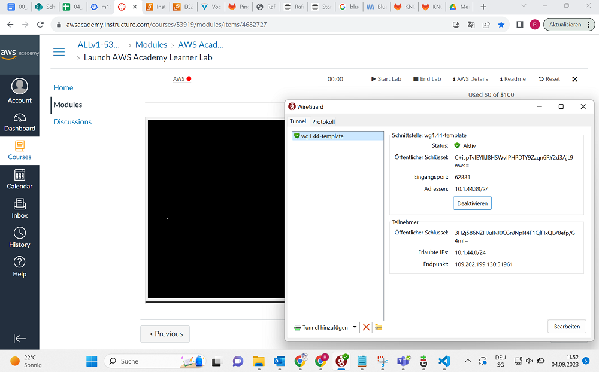

# Instanzvergleich im AWS-Pricing | A
Die Aufgabe ist es, eine t2.micro Instanz und eine m4.xlarge Instanz durchzuführen und zu vergleichen, wie sich die Beiden Typen unterscheiden.

## On-Demand Pricing
Also, um zu sehen wieviel US-Dollar unsere Instanz isst, müssen wir erst auf Amazon AWS uns anmelden, mit Wireguard unsere Schnittstelle aktivieren und dann wieder zurück, unter "Module" unsere Verbindung launchen. Das nur fürs Protokoll, der Weg kann kompliziert sein.

Jedenfalls, wenn wir das getan haben, müssen wir weiter ins Programm rein, durch EC2, um zu unseren möglichen Instanzen zu kommen. Dort angekommen, können wir eine neue Instanz launchen, um dann unsere beiden Instanztypen zu vergleichen.

Das Bild zu den Preisen unserer Instanztypen:

Wie wir hier sehen, müssen wir für die m4.xlarge Instanz, über das 20fache Bezahlen pro Stunde, im Vergleich zur t2.micro Instanz. Im Endeffekt sind das zwar trotzdem nur 0,3USD pro Stunde zu 0.016USD pro Stunde. Dafür hat der m4 auch die vierfache Leistung.
Wenn wir das auf einen Monat hochrechnen wollen würden, wären das für die m4.xlarge Instanz 216$ und für die günstigere, leistungsschwächere t2.micro Instanz, 43,2$. Die m4.xlarge Instanz kostet genau 5x soviel wie die t2.micro Instanz. Und das für die ca 4fache Leistung. Wir haben den Sprung von einem GibiByte Memory direkt auf 16 GiB Memory und 4 virtuelle CPUs anstatt einem.
Ich würde sagen, wenn man Excel Tabellen füllen will, Prozesse im Hintergrund laufen lassen will, ist man mit der t2.micro Instanz auf jeden Fall ausreichend aufgehoben. Wenn man aber jetzt Datenbank Server oder einen Email Server aufsetzen will, würde ich schon die m4.xlarge Instanz empfehlen.

## Ist das Vertical Scaling oder Horizontal Scaling?
Wir müssen das so sehen. Stellen wir uns vor dass wir einen Computer haben, der auf der Seite liegt. Das ist unser aktuelles Gerät und nun wollen wir den scalen. Wir können ihn entweder in die Länge ziehen und dabei CPU, RAM, Storage etc. hinzufügen oder wir können einen weiteren PC auf ihn drauf legen womit wir virtuell gesprochen mehr Nodes oder Systeme hinzufügen.
Vom Ding her haben wir uns also hier über Vertical Scaling unterhalten.

## Probleme
Wichtig zu sagen ist, dass man nur die Preise vergleichen soll, die man in der Vorschau der Auswahl sieht. Wenn man Versucht 2 Instanzen mit dem gleichen Public Key zu starten, gibt es eine lange Fehlermessage und die Instanz kann nicht gestartet werden. Das ist mir am Anfang passiert.

