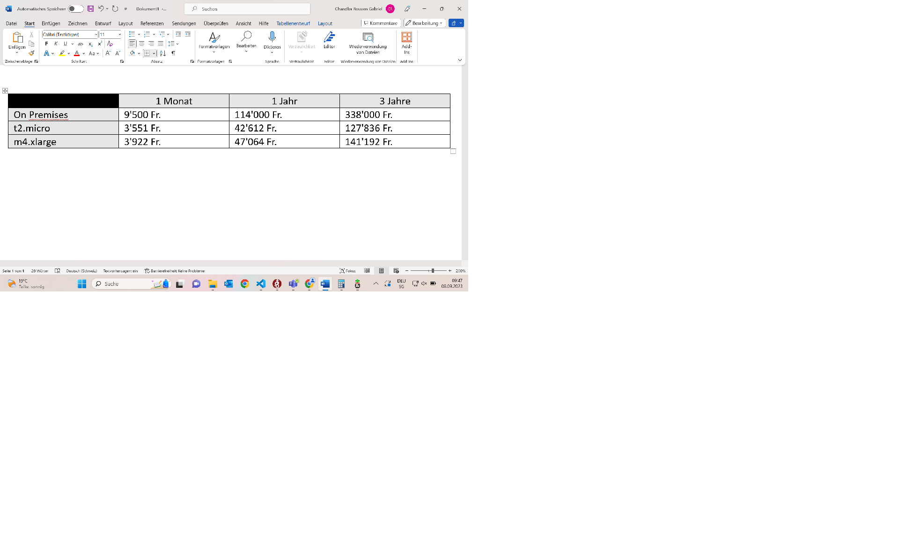
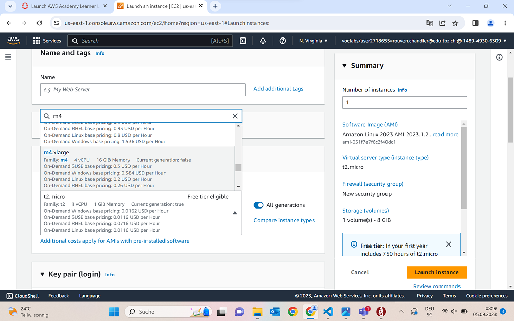
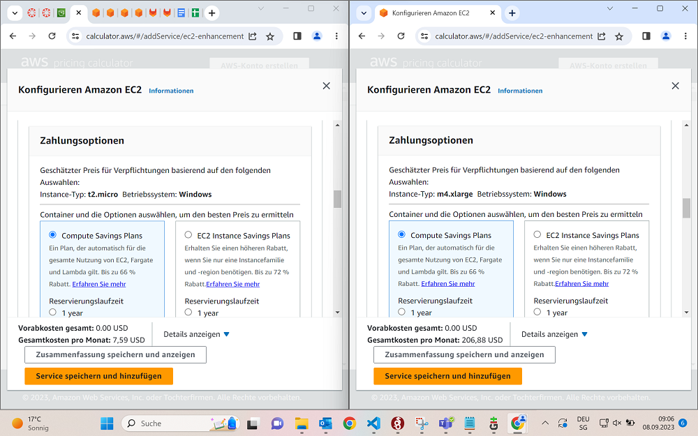

# Evaluation Cloud-Migration für ein Unternehmen | B
Stand der Dinge, wir haben ein 50 Personen Unternehmen und betreiben aktuell die IT On-premises Lösung. Dies soll sich aber ändern und in 3 Jahren wird die Hardware abgeschafft. Deswegen überlegen wir uns auf Cloud umzusteigen. Wir machen das einmal umfangreich und genau für 3 Jahre und sehen dann ob es sich lohnt und wenn ja, wohin.

## On Premises
Unsere aktuelle Kostenlage ist ca bei 9500 Fr. Unsere Kosten pro Monat sind:
+ Raummiete: 1000 Fr.
+ Administration: 1000 Fr.
+ Server (HPE Proliant): 2500 Fr.
+ Netzwerk und weitere Geräte: 2500 Fr.
+ Diverses (Lizenzen etc.): 2500 Fr.
+ GESAMT: 9500 Fr.

Das ist ziemlich teuer und wir wollen sehen ob es nicht günstiger wäre, auf Cloud Server umzusteigen.

## t2.micro
Unser erster Kandidat im AWS Instanzen System ist t2.micro. Wichtig noch anzumerken ist, dass wir 20TB Speicher pro Server brauchen. Normalerweise ist dies ja eher die günstige Variante, aber durch die wahrscheinliche hochskalierung werden wir sehen ob sie besser ist als das was wir gerade haben.

Unsere Kosten pro Monat sind:
+ AWS EC2 t2.micro: 43.2 Fr.
+ AWS S3 t2.micro: 7.59 Fr.
+ Administration: 1000 Fr.
+ Diverses (Lizenzen etc.): 2500 Fr.
+ GESAMT: 3550.61 Fr.

## m4.xlarge
Unser zweiter Kandidat im AWS Instanzen System ist m4.xlarge. Dieser ist um einiges grösser und das zeigt sich daher auch in den Mietkosten.

Unsere Kosten pro Monat betragen:
+ AWS EC2 m4.xlarge: 216 Fr.
+ AWS S3 m4.xlarge: 206.88 Fr.
+ Administration: 1000 Fr.
+ Diverses (Lizenzen etc.): 2500 Fr.
+ GESAMT: 3922.88 Fr.

## Vergleich

## CLOUD-VORTEILE
+ Es kostet fast 3x weniger die Cloud zu nutzen.
+ Die Betreiber sind Experten auf ihrem Gebiet.

## CLOUD-NACHTEILE
+ Fremde Leute verwalten unsere Server
- Wir müssen alles umstellen und übertragen auf die neuen Server.

## Lösungsvorschlag
Ich schlage vor, wir gehen auf jeden Fall in die Cloud. Wir sparen fast 2 Drittel des Geldes, was wir heute noch für die On Premises Server ausgeben. Wir müssen zwar unsere vorhandenen Server auf den Cloud-Server übertragen, aber bei der Cloud arbeiten viele Experten, die sich damit auskennen. Wenn wir uns jetzt überlegen ob wir die Instanz t2.micro oder m4.xlarge nehmen wollen, empfehle ich die t2.micro Instanz. Wir haben gerade einfach kein Bedürfnis, sodass wir problemlos mit der t2.micro Instanz arbeiten können. Sollten wir in Zukunft trotzdem eines Tages Probleme haben, können wir mit ein paar Klicks sofort die Instanz auf m4.xlarge skalieren und wir hätten gar keine Umstände.

## Ressourcen
Fürs Protokoll ist hier noch einmal der Screenshot, um die Preise festzuhalten. Hier haben wir erst einmal die normalen EC2 kosten der beiden Instanzen:

Und da wir natürlich noch den S3 Speicher brauchen, wollte ich dies Vollständigkeitshalber auch noch festhalten:

## Quellen
+ Gitlab M346
+ Amazon AWS die Kostentabellen