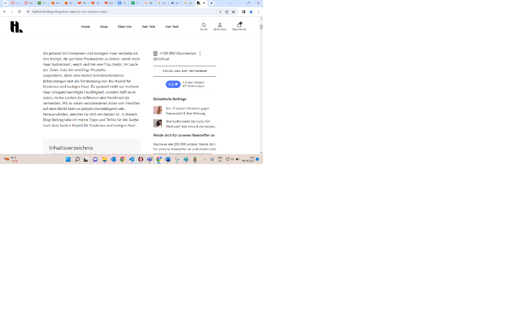

# Cloud Computing Generell
## Was sind die Vorteile von Cloud Computing?
Dadurch, dass alles auf der Cloud gespeichert ist, kann es nicht passieren, dass plötzlich Daten verloren gehen durch Hardwarefehler. Die Cloud selbst ist natürlich programmiert und so kann es nicht passieren, dass ein physisches Baustück falsch montiert wird und es den Computer zum crashen bringt.

Cloud Computer sind extrem flexibel wie oft schon erwähnt. Das horizontale oder vertikale Skalieren bringt den Computer dazu, auf alle Leistungs/Hardware Problemen, eine schnelle Antwort zu finden.

Es ist auch viel günstiger als die On Premise Lösung, wie man vor allem im letzten Kompetenznachweis sehen konnte. Da kann man ganz leicht 2/3 des Preises einsparen.

## Was hatte Cloud Computing für einen Impact?
Cloud Computing hat die ganze Informatik, alles was man davor kannte, völlig auf den Kopf gestellt. All die Kentnisse die man damals hatte waren plötzlich outdated und man musste lernen mit dem Cloud Computing umzugehen. Durch die vielen Vorteile und vor allem die extreme Preissenkung, war das etwas, was nicht einfach ignoriert werden konnte. Cloud Computing hat die Informatik revolutioniert und heutzutage benutzen eigentlich alle grossen Unternehmen die Cloud. Microsoft Office, Youtube etc.

# Other Questions
## Purpose
*Often, the purpose of a website (or app) is different to a user than to the creator. For example, Google’s search engine provides a service to users by bringing them fast and effective search abilities. For Google, however, searches provide data about users that Google can analyze to present users with targeted advertisements. Think about a website (or app) that you use often. What is the purpose of the website (or app) to the user and the creator? Are these purposes similar or different?*

Ich glaube die Sache mit der Data-Sammlung kann man auf ganz viele Unterhaltungsmedien beziehen. Besonders Social Media, was Youtube, Tiktok, X oder Instagram mit einschliesst. Cookies die im Browser permanent aufploppen sind ja nur dazu da dass Daten getracked werden. Nehmen wir als Beispiel mal unseren Blog namens WeinrichBlogs. Diese Webseite hat wahrscheinlich ein Abkommen mit Werbungen, dass die Webseitenbetreiber jedesmal eine Provision bekommen, wenn Leute auf die Werbung klicken oder sogar etwas kaufen. Demnach ist das Ziel unseres Blogs hier User dazu zu bringen, Werbung zu konsumieren. Umgekehrt wollen die Personen die WeinrichBlogs lesen.

## Domains
*A website’s domain name is often our first impression of a website, even before we look at the content. Names like Wikipedia, Twitter, and Facebook evoke ideas for how they will be used. However, names like Google and Amazon don’t tell you much about what they are for. What factors do you think are important when naming a website and why? How does a website’s name impact the user’s experience and impressions of the website? When naming your own website, what are at least two factors that will be most important to you?*

Ich glaube es kommt seriöser rüber, wenn man eine Webseite besucht, die etwas mit dem zu tun hat, für die sie steht. Letztens tatsächlich habe ich etwas über Haare gesucht und da waren viele Webseiten mit dem Namen "Haare" in der Domain. Ich finde sie wirken irgendwie seriöser, so als ob sie experten seien in dem Gebiet. Denn sie haben ja ihre ganze Webseite dem Thema gewidmet oder? Im Endeffekt ist das der erste Eindruck. Ob dies sich dann bewährt, ist eine andere Frage.

In dem Beispiel hier findet man aber leider sehr viel Selbstbeweihräucherung und es wird sehr suggeriert wie toll alles auf dieser Seite ist und generell die Marke ist perfekt, was leider schon wieder unseriös wirkt. Wie gesagt, die Domain ist nur der erste Eindruck!

## Cookies
*Many websites store data about your usage of the website on your computer (called cookies) or on the website (called session variables). This data allows the website to not only personalize your usage, but also to learn about your patterns and history of usage. This means that websites can give you better recommendations and quickly auto-complete forms. However, it also means they can sell your information to advertisers. This can mean easier and more efficient access at the cost of privacy. When it comes to this type of data gathering, do you think the trade-off is worth it? Why or why not? Should websites have to be more transparent about what types of data they are gathering? Should you be able to opt out?*

Ich finde es ist gerechtfertigt. Es ist extrem schön, wenn man auf Google nach etwas sucht und dann direkt oben die Seiten findet die man schon besucht hat. Ähnlich ist es bei Youtube. Wenn ich einen Kanal kenne und schon Videos von ihm geschaut habe, wird mir das viel viel mehr vorgeschlagen. Auch bei Suchanfragen. Im Umkehrschluss haben wir hier aber die Werbung. Und da muss man sich beherrschen können. Ich weiss nicht, es ist schwer zu sagen wieviele Leute schon irgendetwas gekauft haben wegen Werbungen, die ihnen random vorgeschlagen wurden, aber ich persönlich habe immer die Angst dass das irgendwie Scam oder ähnliches sein könnte, weswegen ich immer die Finger davon gelassen habe.

## EC2, S3 Webseite Hosting
*Explain how an S3 bucket and EC2 instance interact to allow for website hosting.*
Also, bevor wir die EC2 Instanz benutzen, müssen wir erstmal den S3 Bucket aktivieren. Da tun wir dann all unsere Webseitenfiles rein. Nachdem wir das gemacht haben, starten wir die EC2 Instanz und konfigurieren einen Web-Server wie zb Apache.
Jetzt kommen wir zum DNS Teil, der DNS sorgt im Anschluss dafür, dass unsere Webseite einen eigenen Domainnamen hat. Das macht man indem man die Adresse im Domain Register des DNS hinzufügt und die IP oder angibt, zu dem er zeigen soll.

## Quellen:
+ ibm.com
+ AWS Kurstext
+ Internetsuche, Google
+ ChatGPT