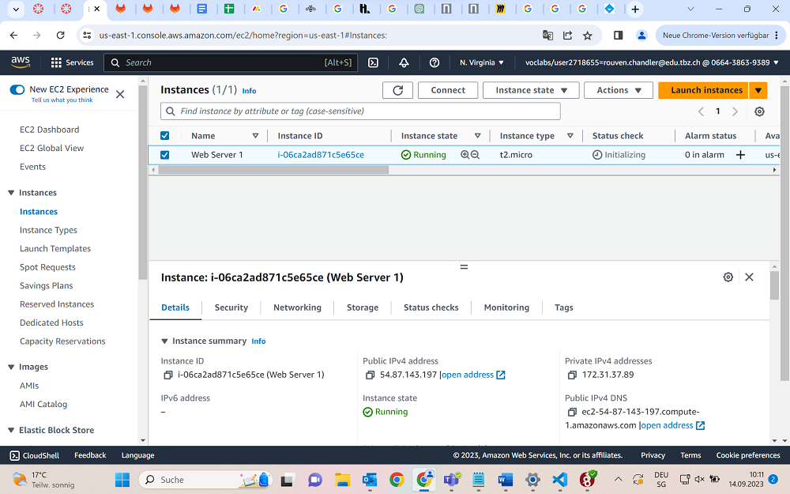
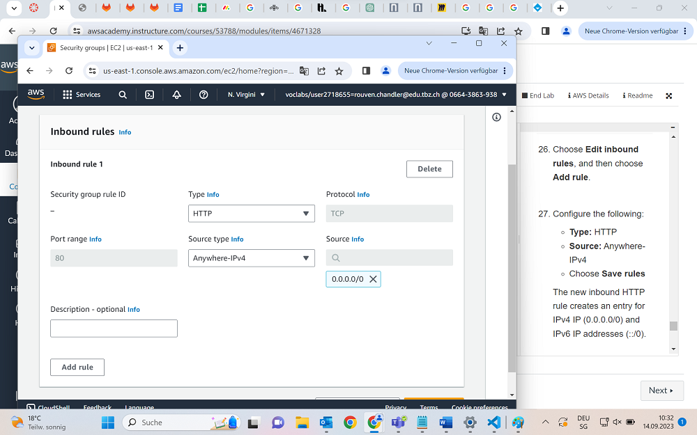
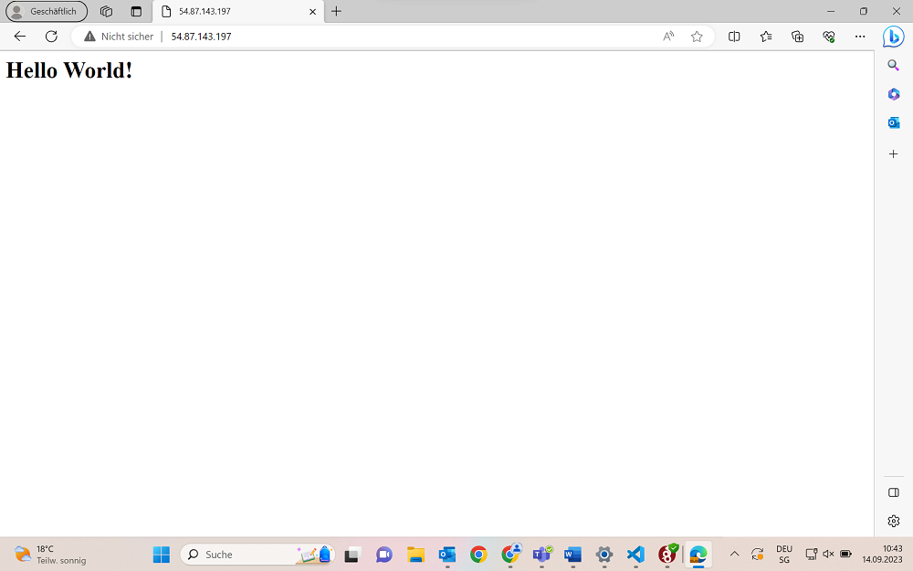

Das hier ist eine Übung aus dem Willkommenskurs von Amazon AWS, die Aufgabe 4.1

## Preparing
Als allererstes erstellen wir unsere Instanz genau so wie vorgegeben.
Im Grunde lassen wir das meiste auf Standard, aber die Security Group wird nach unseren Wünschen angepasst und so beendet, sodass wir später eine ssh Inbound Rule erstellen können. Manuell. Ausserdem haben wir ein Skript laufen lassen, welches automatisch alles perfekt setupt, um als Webserver funktionieren zu können.

Wenn wir das alles erledigt haben, können wir die Instanz launchen.

## Zwischenstand: unsere Web-Server-Instanz

## Access bekommen
Um auf den Server zuzugreifen, müssen wir die Public IPv4 als Adresse eingeben.
Dies funktioniert aber nun nicht, wir bekommen einen Connection Timeout Error. Um das Problem zu beheben müssen wir unsere Security Group updaten, was wir vorhin ausgelassen haben. Demnach müssen wir links in der Navigation unsere Web-Server Security Group finden, selecten und auf den Inbound Rules Tab gehen. Dort adden wir jetzt eine neue Rule mit spezifischen Angaben.

Wenn jetzt alles funktioniert hat, sollten wir auf die Webseite per IPv4 kommen, auf welcher "Hello World" steht. Man muss noch darauf achten, dass man auch wirklich HTTP in der Adressleiste drinnen hat. Mit HTTPS funktioniert das ganze nicht!

## Quellen
+ AWS Tutorial Kurs