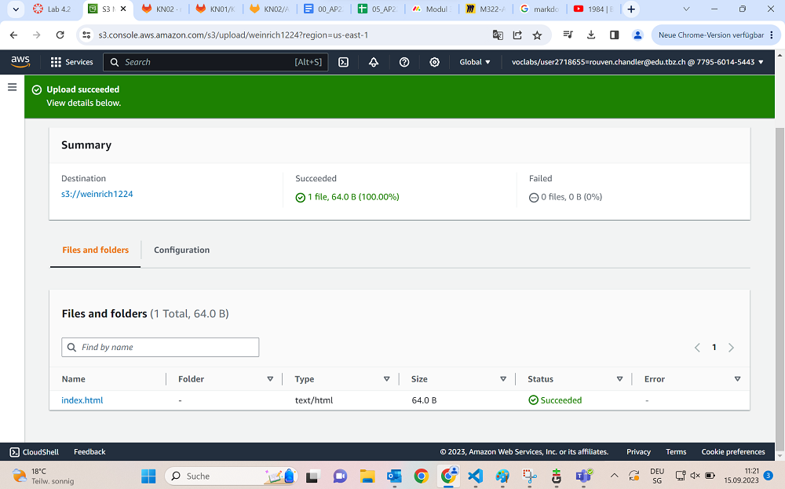
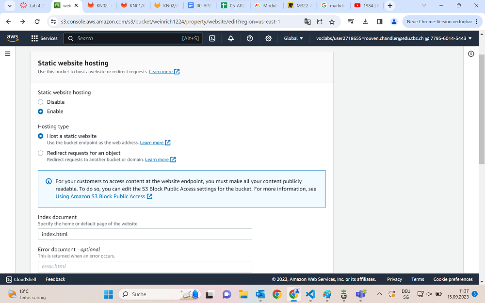
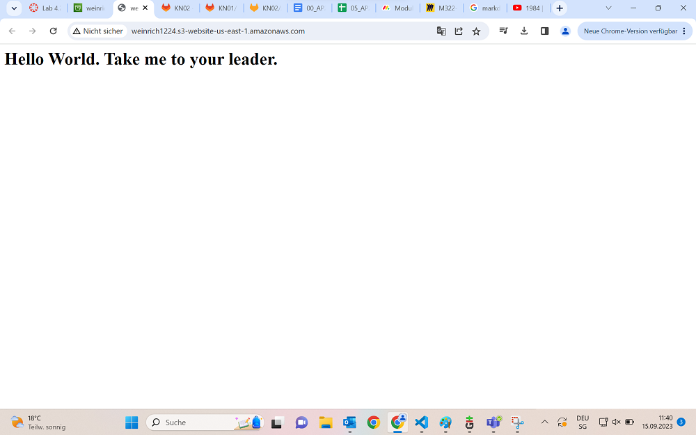

Das hier ist eine Übung aus dem Willkommenskurs von Amazon AWS, die Aufgabe 4.2

## Vorbereitung.
Als erstes erstellen wir in S3 einen neuen Bucket mit einem uniquem Namen und der Region "N. Virginia"
Wichtig ist es, dass wir alle Public Accesses unblocken. Da das anscheinend eher ungewöhnlich ist, müssen wir unterhalb noch einmal bestätigen, dass wir das wirklich ernst meinen und den Public Access zulassen.
Danach können wir unseren Bucket erstellen.
Wenn wir das alles richtig gemacht haben, sieht es dann so aus:

## Konfiguration
Wenn wir nun auf unseren Bucket-Namen klicken, kommen wir auf eine neue Page mit vielen Tabs um Einstellungen vorzunehmen. Im Anschluss kopieren wir einen Code um ihn in unsere Bucket Policy einzufügen. Das sorgt dafür, dass wir später auf die Webseite zugreifen können. 
 
 ~~~ 
 {
    "Version":"2012-10-17",
    "Statement":[
        {
            "Sid":"PublicReadGetObject",
            "Effect":"Allow",
            "Principal":"*",
            "Action":[
                "s3:GetObject"
            ],
            "Resource":[
                "arn:aws:s3:::weinrich1224/*"
            ]
        }
    ]
} 
~~~

## HTML - Dokument
So nun downloaden wir eine einfache html-Page und legen sie in die "Object" Seite von unserem Bucket.
Wenn wir das alles richtig gemacht haben, sieht unser Screen dann so aus:

Kurz darauf müssen wir bei unserem Object weiter rein gehen bis wir zu einer Properties Seite kommen über unsere index.html Seite. Hier müssen wir schauen dass wir die Standard Storage Class selected haben.

Wieder zurück sind wir bei der Hauptseite von unserem Bucket und unter "Properties" sehen wir zuunterst die Static Hosting Website.
Hier müssen wir einerseits die Webseite enablen und andererseits unser Dokument namens index.html angeben.

Gleich darauf, nach dem Bestätigen, gehen wir zurück nach unten zur gleichen Stelle und dort sollte nun ein Link zu sehen sein, welcher auf die Webseite führt.

## Endergebnis

## Quellen
+ Julie - Git Kurs
+ Gitlab Kurs
+ AWS Introduction Kurs