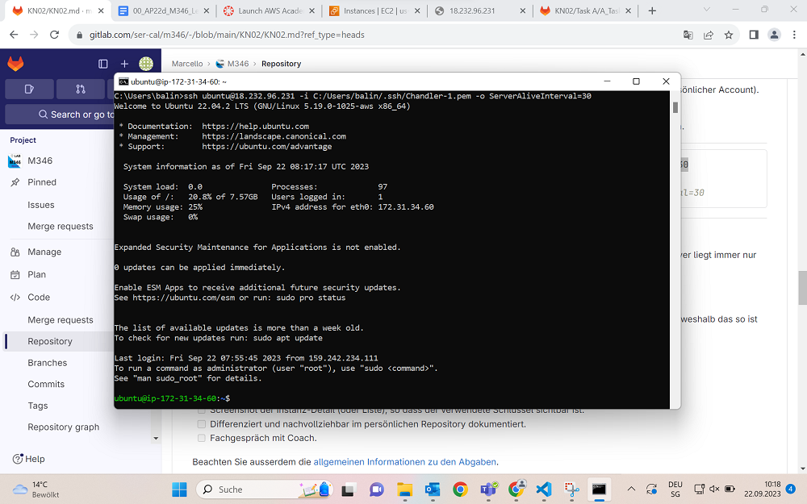
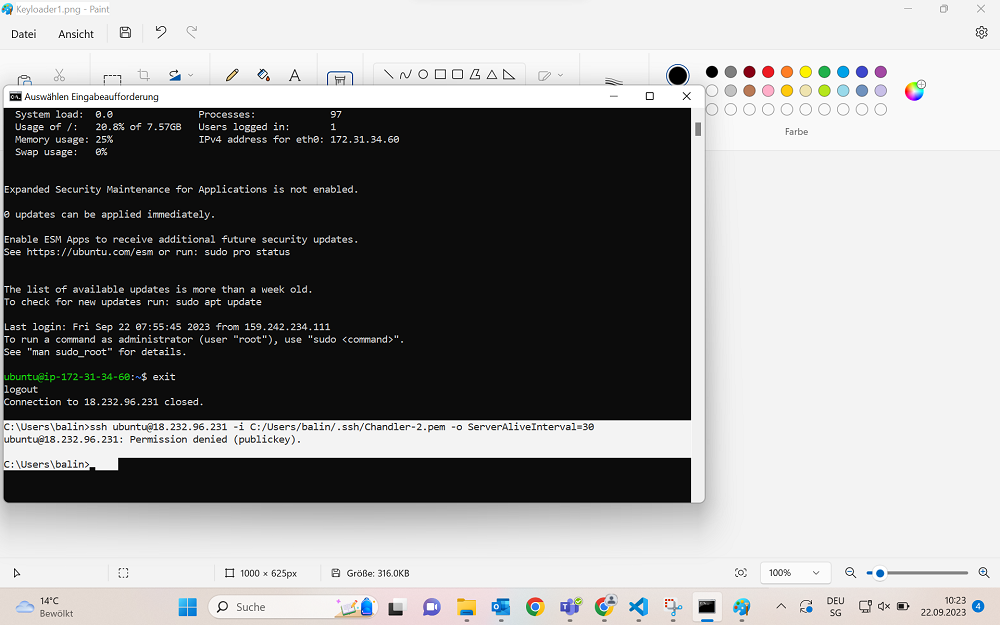

# KN02 - Task B
## Preparing
So zuallererst müssen wir wieder eine Instanz erstellen auf EC2 auf einer Linux Ubuntu Vorlage. (Ubuntu Server 22.04 AMI (Amazon Machine Image))

Ebenfalls sehr wichtig ist das ankreuzen des Feldes in der Security Group wo HTTP-Connect steht.

Wenn wir das gemacht haben, scrollen wir weiter nach unten, unter der t2.micro Instanz, dort sehen wir die Schlüssel Paare. Hier erstellen wir uns einen neuen Schlüssel.

## Durchführung
Nachdem wir dies gemacht haben, gehen wir auf Git Bash und geben folgenden Command in die Konsole ein:
ssh <user>@<server> -i <path-to-privatekey>\<private-key-file>.pem -o ServerAliveInterval=30

Wenn unser Command funktioniert hat, sieht die Kommandozeile beim ersten Schlüssel so aus:

Beim zweiten Key hingegegen werden wir nicht in die Instanz hineingelassen, da wir nur ein Key-Pair approved haben.

## Quellen
+ M346 Repository
+ Hr. Callisto
+ Julie