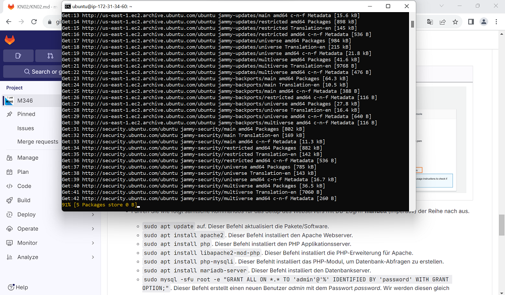
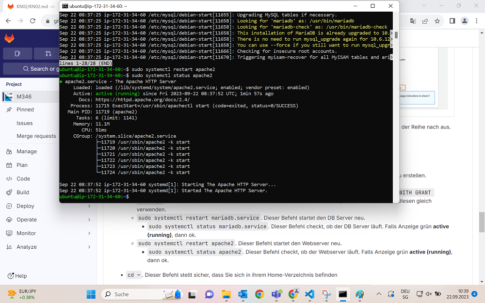
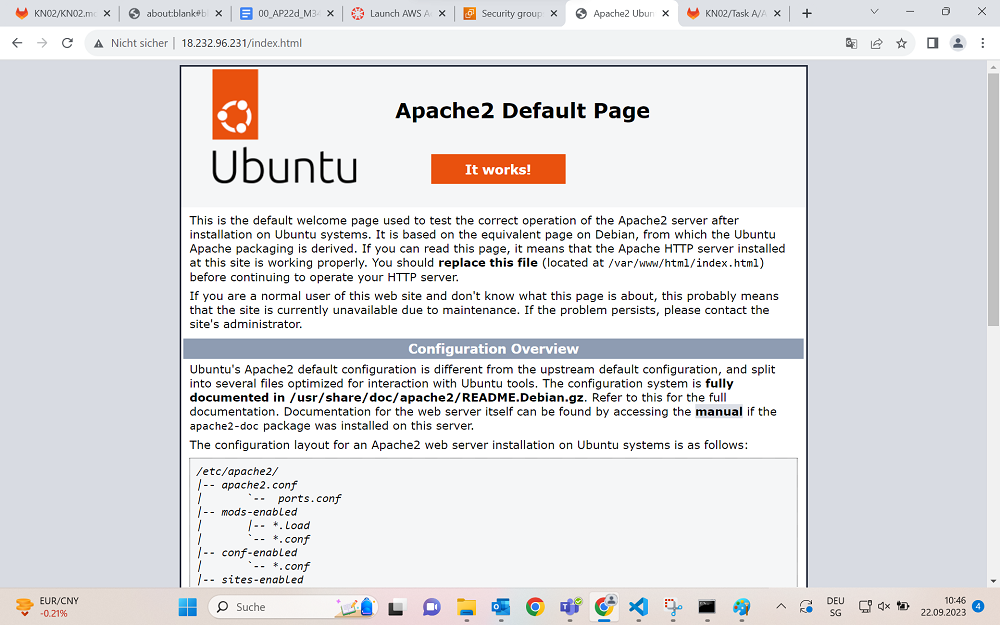
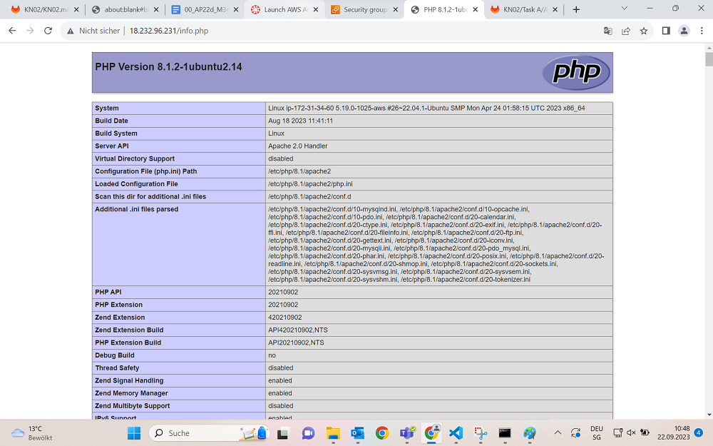
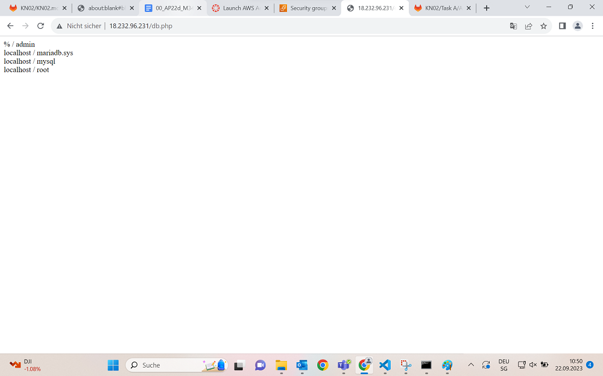

## Preparation
So, zuallererst müssen wir checken ob in der Security Group die richtigen Ports ausgewählt sind.
+ SSH: 22
+ HTTP: 80

## Kurzfassung B
Im Grunde müssen wir jetzt genau das machen was wir in der Aufgabe B gemacht haben, aber ich fass das man ganz schnell zusammen.
+ SSH-KeyPair createn in der Instanz
+ SSH-KeyPair in den Benutzer > .ssh Ordner speichern
+ In der Kommandozeile diesen Befehl hier eingeben: "ssh <user>@<server> -i <path-to-privatekey>\<private-key-file>.pem -o ServerAliveInterval=30"

Und schon ist unser Server ready zum weitermachen.

## Updates und Installationen
Im Anschluss müssen wir ganz viele Dinge installieren wie einen Webserver mit Apache oder eine Datenbank mit php.

Im Anschluss restarten wir den Apache2 Server und die MariaDB Datenbank. Falls im Status grün "running" steht, haben wir es geschafft.

Daraufhin clonen wir das offizielle Gitlab Repository in der ubuntu Kommandozeile wo wir gerade auch drin sind und kopieren mit "sudo cp ./m346-scripts/KN01/*.php /var/www/html/" die ganzen php Dateien aus dem KN01.

## Seitenaufrufung
Jetzt können wir, falls alles funktioniert hat, die ganzen Pages öffnen unter unserer IP und kommen auf die Main Seite der verschiedenen Applikationen.

It works!

Alle Webseiten sind natürlich "unsicher" markiert weil wir hier nur mit HTTP zugreifen.

