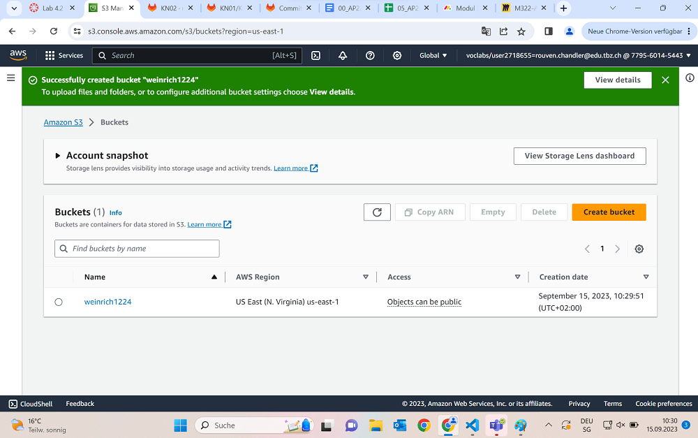

Das hier ist eine Übung aus dem Willkommenskurs von Amazon AWS, die Aufgabe 4.2

## Vorbereitung.
Als erstes erstellen wir in S3 einen neuen Bucket mit einem uniquem Namen und der Region "N. Virginia"
Wichtig ist es, dass wir alle Public Accesses unblocken. Da das anscheinend eher ungewöhnlich ist, müssen wir unterhalb noch einmal bestätigen, dass wir das wirklich ernst meinen und den Public Access zulassen.
Danach können wir unseren Bucket erstellen.
Wenn wir das alles richtig gemacht haben, sieht es dann so aus:

## Konfiguration
Wenn wir nun auf unseren Bucket-Namen klicken, kommen wir auf eine neue Page mit vielen Tabs um Einstellungen vorzunehmen. Im Anschluss kopieren wir einen Code um ihn in unsere Bucket Policy einzufügen. Das sorgt dafür, dass wir später auf die Webseite zugreifen können. 
 
 ~~~ {
    "Version":"2012-10-17",
    "Statement":[
        {
            "Sid":"PublicReadGetObject",
            "Effect":"Allow",
            "Principal":"*",
            "Action":[
                "s3:GetObject"
            ],
            "Resource":[
                "arn:aws:s3:::example-bucket/*"
            ]
        }
    ]
} ~~~

## Quellen
+ Julie - Git Kurs