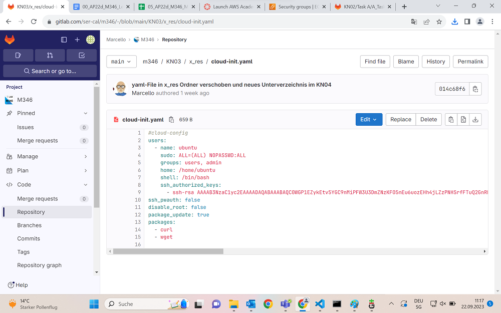

## Analyse
Am Anfang werden die Users bestimmt.

Der Name wird festgelegt zu Ubuntu
Sudo - wird frei verfügbar gemacht, dass man kein Password eingeben muss wenn man es verwendet
Groups - das sind die beiden Users die existieren
home - ist unser Homeordner wo wir drin operieren
shell - ist der Pfad zur Shell in welcher wir arbeiten
ssh-rsa - ist unser Authentifikations Key vom SSH KeyPair
ssh_pwauth - legt fest ob wir ein Password haben oder nicht.
disable_root - Das hier sagt ob wir extra Rootrechte verstecken wollen aber wir haben Root Rechte.
package_update - für die regelmässigen Updates unseres Servers

Und zuunterst sind noch die Packages die wir besitzen.

`
users:
  - name: ubuntu
    sudo: ALL=(ALL) NOPASSWD:ALL
    groups: users, admin
    home: /home/ubuntu
    shell: /bin/bash
    ssh_authorized_keys:
      - ssh-rsa AAAAB3NzaC1yc2EAAAADAQABAAABAQC0WGP1EZykEtv5YGC9nMiPFW3U3DmZNzKFO5nEu6uozEHh4jLZzPNHSrfFTuQ2GnRDSt+XbOtTLdcj26+iPNiFoFha42aCIzYjt6V8Z+SQ9pzF4jPPzxwXfDdkEWylgoNnZ+4MG1lNFqa8aO7F62tX0Yj5khjC0Bs7Mb2cHLx1XZaxJV6qSaulDuBbLYe8QUZXkMc7wmob3PM0kflfolR3LE7LResIHWa4j4FL6r5cQmFlDU2BDPpKMFMGUfRSFiUtaWBNXFOWHQBC2+uKmuMPYP4vJC9sBgqMvPN/X2KyemqdMvdKXnCfrzadHuSSJYEzD64Cve5Zl9yVvY4AqyBD aws-key       
ssh_pwauth: false
disable_root: false 
package_update: true
packages:
  - curl 
  - wget 

`