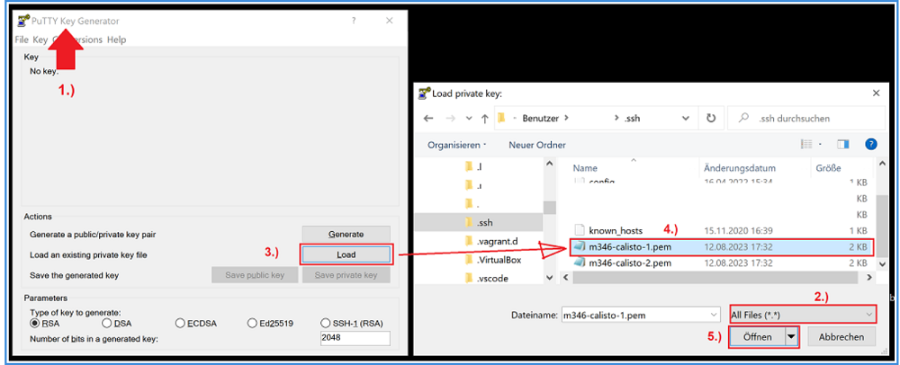
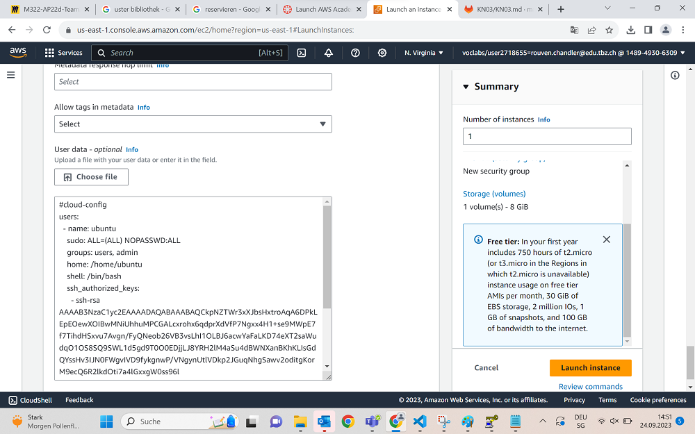
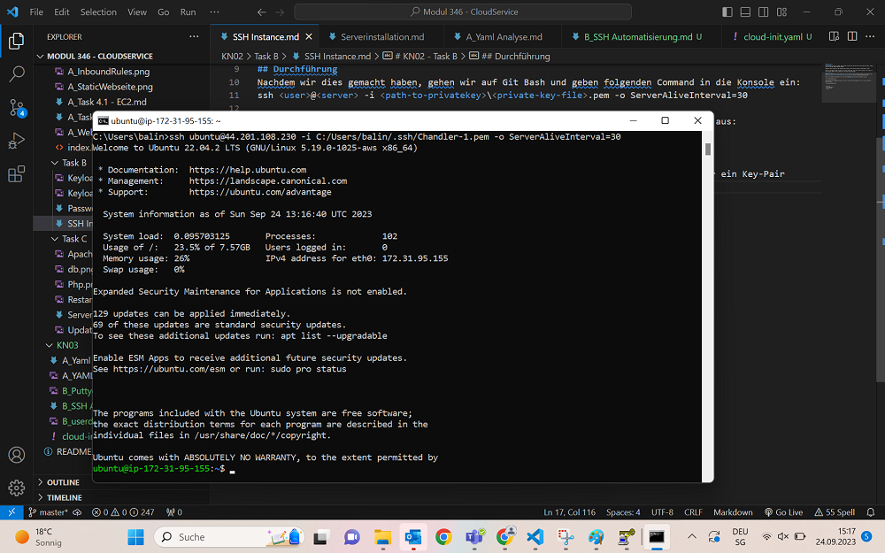

## Vorbereitung
Also zuallererst müssen wir die Applikation Puttygen installieren.

Kurz darauf loaden wir wie angezeigt unseren Private Key den wir in vorherigen Übungen erstellt haben. Wichtig ist hierbei dass man wirklich die Software "Puttygen" öffnet und nicht nur "Putty".
Wir laden auf jedenfall unser private Key .pem File hoch und dank Putty können wir einen dazugehörigen Public Key herunterladen, der dazu funktionieren sollte.

## Durchführung
Nun wollen wir testen ob unser Key funktioniert. Wir erstellen also eine neue Ubuntu Instanz und wählen dieses mal unser *zweites* KeyPair aus.
Unter "Advanced" und "Userdata" laden wir unser yaml-File hoch, welches wir zuvor so bearbeitet haben, dass unser heruntergeladene private Key hinter ssh-rsa steht.
Das sieht dann so aus:

Wichtig anzumerken ist noch, dass #cloud-config unbedingt im Yaml File stehen muss, da es ansonsten nicht korrekt ausgeführt wird.

Wir geben in unserer Konsole wieder den gleichen Command ein wie damals als wir uns mit unserem Private Key connecten wollten und unser Schlüssel 1 funktioniert.

## Auswertung
Wir haben in dieser Übung einen extra Public Key anfertigen lassen für unser 1. Key Paar. Diesen Schlüssel haben wir dann in unser cloud.init Script geschrieben während wir auf der Instanz selbst den 2. Public Key angegeben haben. Dieser funktioniert jedoch nicht, da es schon einen Public Key gibt und der erste in unserem File weil es vom User speziell kam eine höhere Priorität hatte und deswegen den ursprünglichen 2. Schlüssel überschrieb.

Demnach konnten wir uns mit dem 2. Schlüssel nicht anmelden. Und unter /var/log/cloud-init-output.log wäre die Log-Datei unter der man nur den 1. Schlüssel sehen würde.

## Quellen
+ Puttygen downloader
+ Repository M346