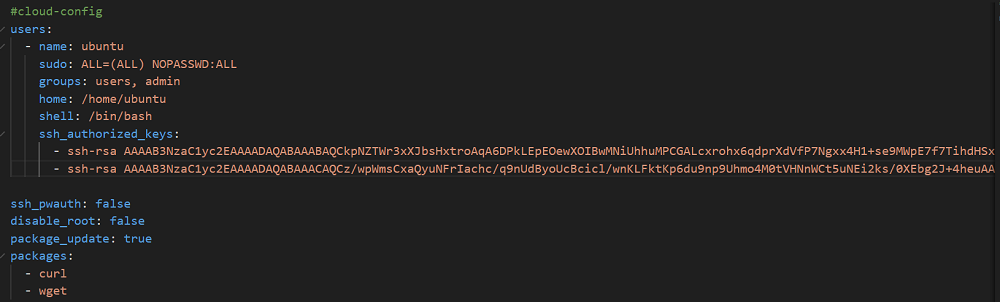

## Aufgabe
Also, wir fügen ganz einfach in unserem ursprünglichen .yaml File Hr. Callisto hinzu als 2. Account und hoffen nun dass er Zugriff auf unsere Instanz bekommt. Eigentlich sollte das jetzt funktionieren.

Wir müssen natürlich die gleichen Schritte am Anfang machen wie in Aufgabe B, aber das ist nicht wirklich schwer.
+ Instanz erstellen
+ Ubuntu 22.4
+ userdata Yaml File hinzufügen
+ Konsole: ssh <user>@<server>
Und schon ist man in der Instanz drin.
