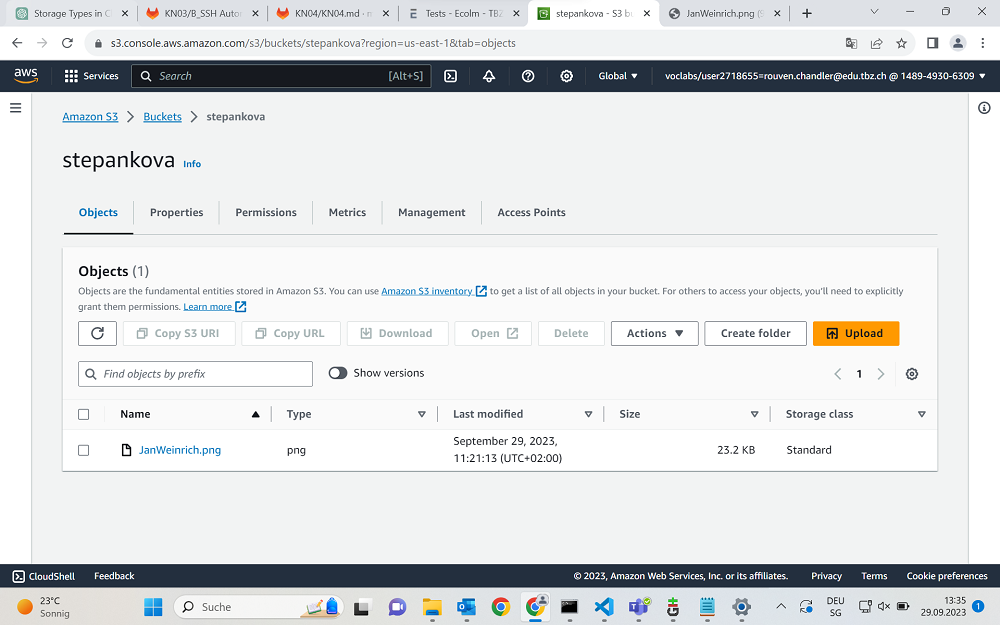

## Bucket erstellen
Als allererstes erstellen wir einen neuen Bucket in S3 mit:
+ Uniquer Name
+ All Public (Bestätigung unten Bestätigen)
Wenn wir das haben, können wir unser Bucket createn.

So, kurz darauf gehen wir in unsere Bucket Sicht

Bisschen weiter unten steht "Bucket Policy" und wir fügen dann diesen Code hier ein:
~~~
{
	"Version":"2012-10-17",
	"Statement":[
		{
			"Sid":"PublicReadGetObject"
			"Effect":"Allow",
			"Principal":"*",
			"Action":[
				"s3:GetObject"

			],
			"Resource":[

				"arn:aws:s3:::stepankova/*"
			]
		}
	]
}
~~~

Das "arn:aws.." etc. ist der Bucket den wir benannt haben.

## Objekt hinzufügen
Wenn wir jetzt auf die Main-Seite gehen, und dort ein Object hinzufügen unter "Upload".

Nun können wir auf unser Bild klicken und werden weitergeleitet über unsere IP zum Bild. So sieht das dann aus:

## Quellen
+ M346 Repository