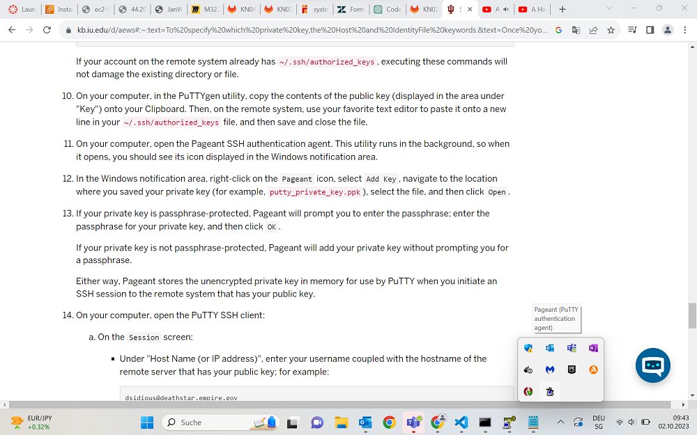
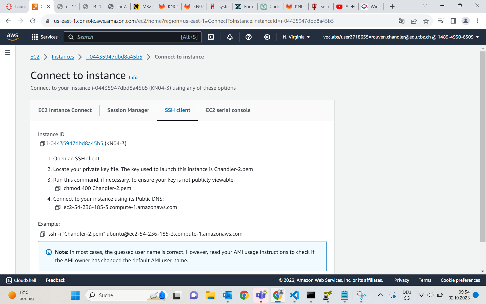
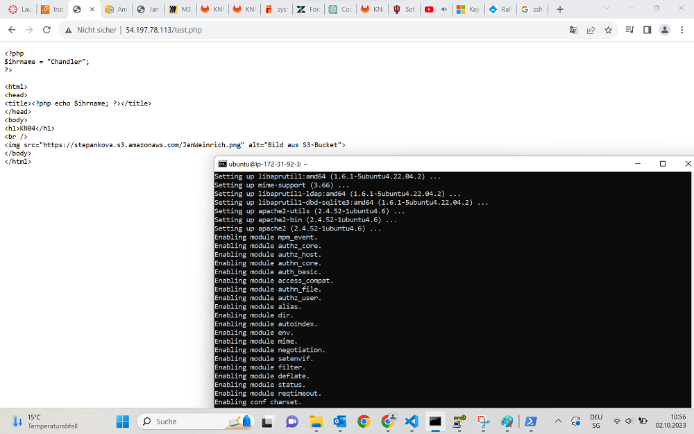
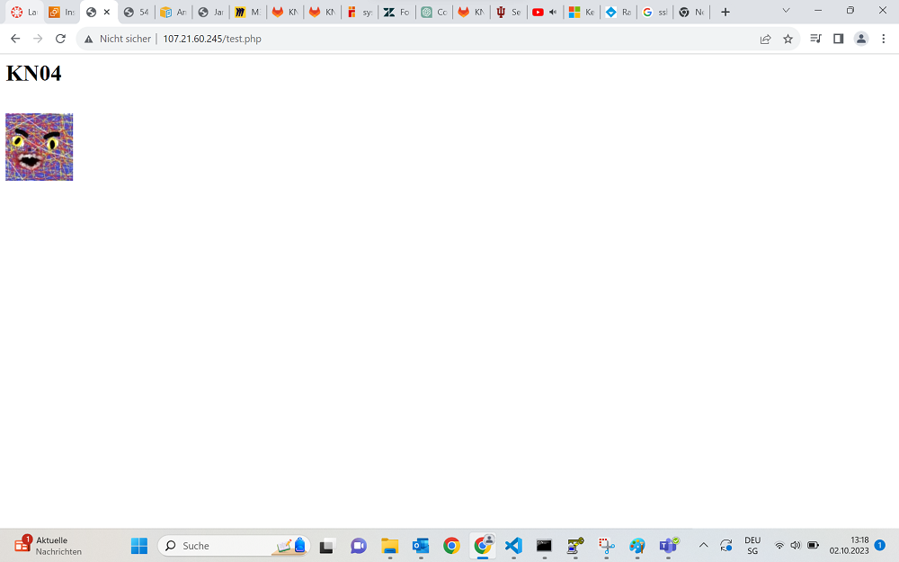

## Texte
In dieser Aufgabe müssen wir unser Bild hochladen noch erweitern, also erstellen wir ein externes php-File was wir mit einer cloud-init.yaml Datei aufrufen lassen um unser Bild auf den Server zu laden. Wenn alles wie geplant funktioniert, sollte das Bild danach auf einer weiteren URL verfügbar sein.

Das ist unser derzeitiger Code:
~~~
#cloud-config
users:
  - name: ubuntu
    sudo: ALL=(ALL) NOPASSWD:ALL
    groups: users, admin
    home: /home/ubuntu
    shell: /bin/bash
    ssh_authorized_keys:
      - ssh-rsa AAAAB3NzaC1yc2EAAAADAQABAAABAQCkpNZTWr3xXJbsHxtroAqA6DPkLEpEOewXOIBwMNiUhhuMPCGALcxrohx6qdprXdVfP7Ngxx4H1+se9MWpE7f7TihdHSxvu7Avgn/FyQNeob26VB3vsLhI1OLBJ6acwYaFaLKD74eXT2saWudqO1OS8SQ9SWL1d5gd9T0O0EDjjLJ8YRH2lM4aSu4dBWNXanBKhKLIsGdQYssHv3IJN0FWgvIVD9fykgnwP/VNgynUtlVDkp2JGuqNhgSawv2oditgKorM9ecQ6R2lkdOti7a4lGxxgW0ss96l+OSLpjrdIR5jZJZYQPFuonyYc4xwLVdy8Salm5Dw7ctWMROI5tNx Chandler
disable_root: false
package_update: true  
packages:
  - wget
  - curl

write_files:
  - content: |
      <?php phpinfo(); ?>
    path: /var/www/html/info.php
    permissions: '0644'
write_files:  # Ab hier wird das gesuchte PHP-File erstellt
- content: |
    <?php
    $ihrname = "Chandler";
    ?>

    <html>
    <head>
    <title><?php echo $ihrname; ?></title>
    </head>
    <body>
    <h1>KN04</h1>
     
    
    </body>
    </html>

  path: /var/www/html/test.php
  permissions: '0644'
runcmd:
  - sudo systemctl restart apache2
~~~

Wenn wir danach diesen Anweisungen folgen:

* Öffnen Sie die AWS Management Console.
* EC2 Instanz benennen (Der Begriff KN04 soll darin enthalten sein).
* Ubuntu AMI (Amazon Machine Image) auswählen.
* Instance type und (bestehendes) Key pair auswählen.
* Bestehende Security Group auswählen (Port 80 inbound offen).
* Cloud-init Script erstellen gem. Vorlage oben (Kernelement dieses Auftrage) und launchen.
* Resultat: Browser öffnen und IP oder DNS-Namen ergänzen mit "test.php" (Bild unten)
  
Funktioniert es NICHT.

## Schlüssel Zuweisung
Wir haben ein Problem. Der ssh-Key wird nicht ausgewählt, heisst unsere Seite wird nicht entschlüsselt und wir können unser Bild nicht sehen. Was wir nun zu tun haben, hängt mit einem sogenannten *Pageant* zusammen. Dieser kann unsere SSH-Keys sammeln und weiterverwenden. 

Tatsächlich ist nun mit dem alten .pem Format Schluss, wir müssen unseren Private Key upgraden zu einem .ppk-File. Mit diesem können wir zwar nicht mehr per Konsole connecten aber wir können ihn im Pageant hinzufügen.

+ Rechtsklick auf den Pageant
+ Add Keys
+ Chandler-1.ppk hinzufügen

Und tatsächlich haben wir nur eine zweite Commandline connection. Das ist ein wenig bedrückend.

## AWS SSH Connection
Ich habe eine kleine Anleitung gefunden unter
+ Instanzen - Connect - SSH-Client

Dies stellt sich aber ebenfalls nur als Commandline Hilfe heraus.

## Lösung
Ich musste ganz normal in die Terminal Server Seite gehen und dort dann zuerst Apache installieren. Nachdem ich das gemacht habe, war die Webseite sofort ready. Zwar wird mein Php nicht richtig angezeigt aber das sollte schnell behebbar sein.

PHP muss ebenfalls installiert sein und wenn man dann in die URL test.php eingeben! Und dann funktioniert es endlich nach den vielen Versuchen.

## Quellen
+ M346 Repository
+ Mein Repository
+ SSH-Connection Webseite - Pageant
+ AWS Instanzen
+ learn.microsoft.com
+ ChatGPT zur Überprüfung des Codes