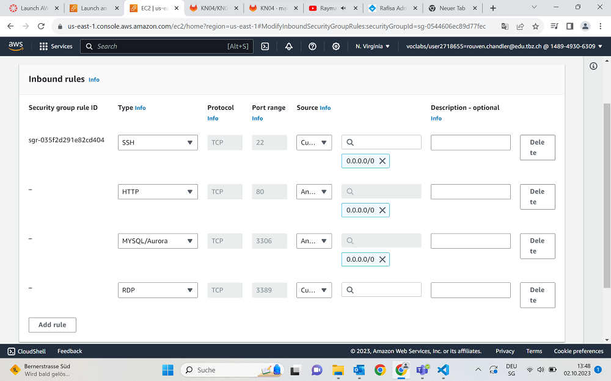
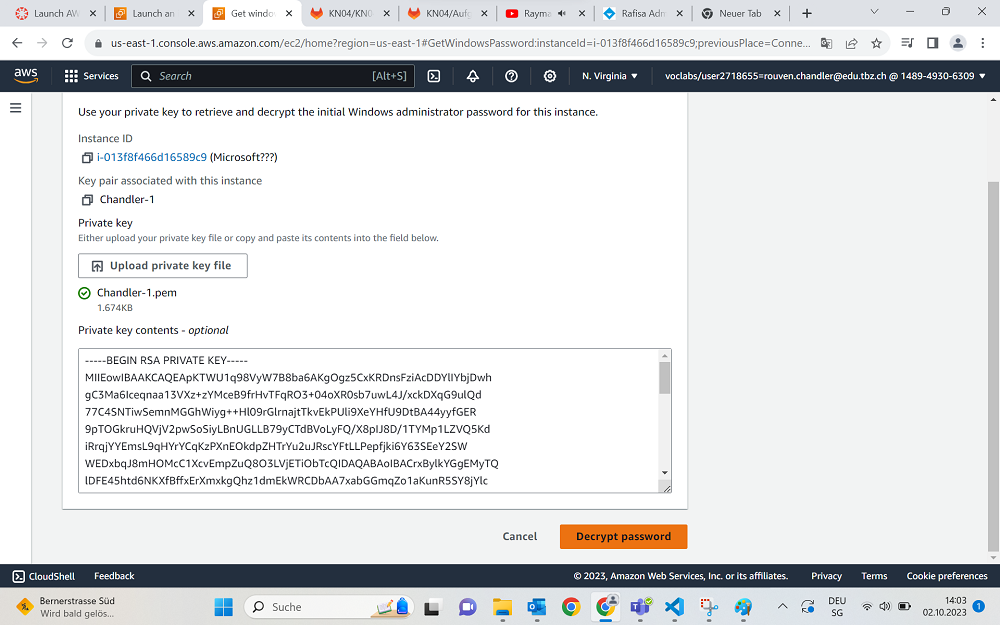
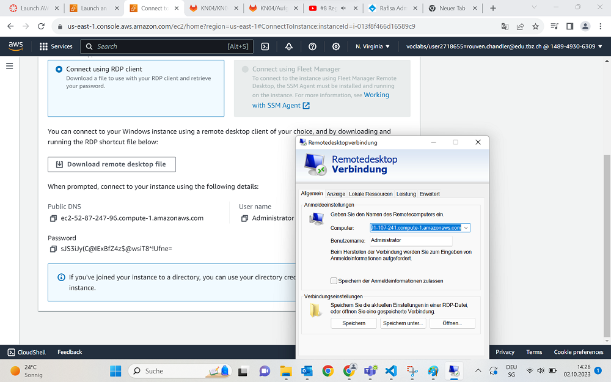
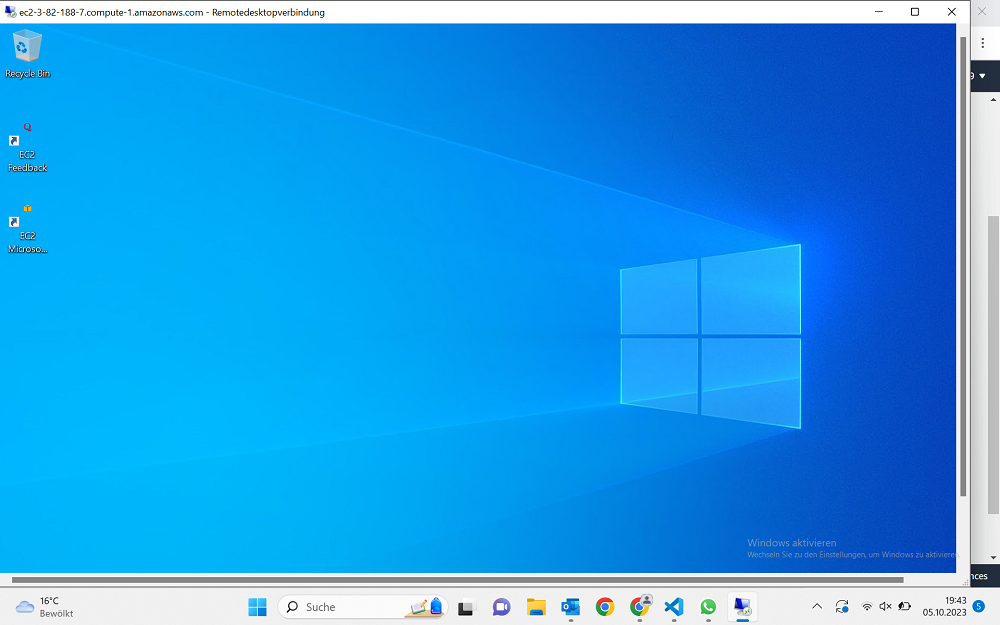
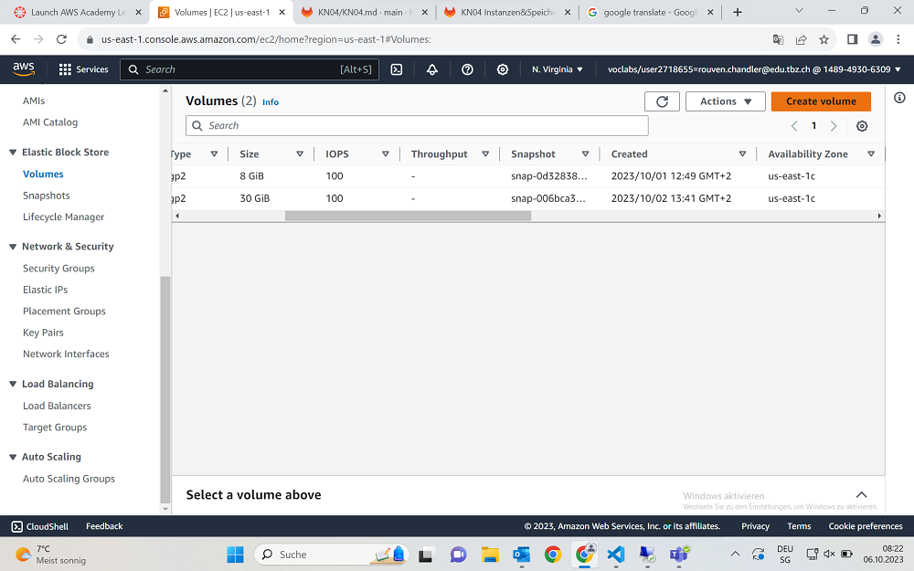
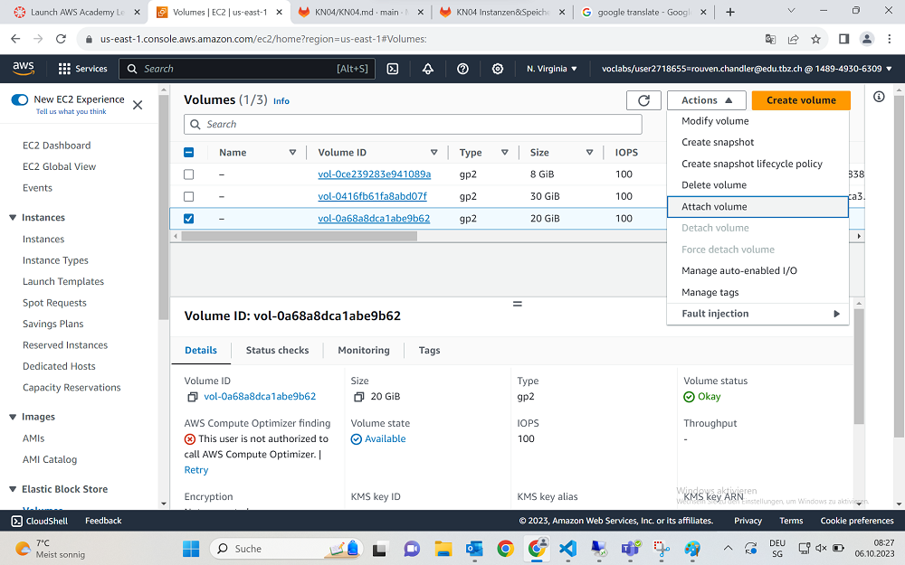
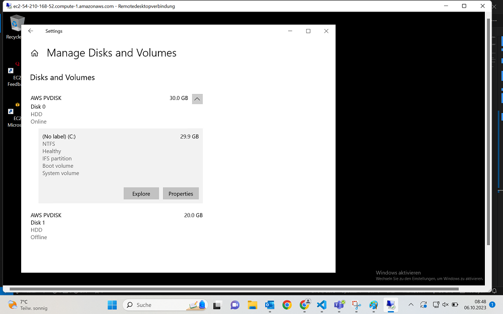
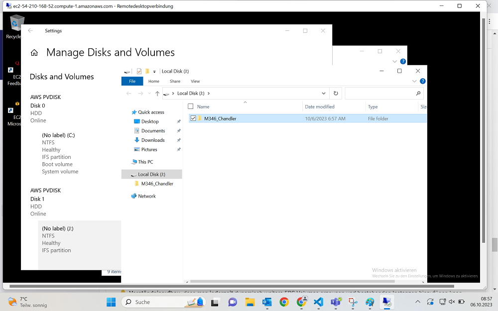

## Vorbereitung
Wie immer setzen wir eine neue Instanz auf, dieses mal jedoch mit Microsoft, statt Ubuntu. Hierbei ist alles wie normal, bis auf die Security Group, bei welcher wir eine bereits bestehende nehmen, welche wir zu einem späteren Zeitpunkt für RDP konfigurieren.

Wir fügen also noch eine Inbound-Rule festlegen, sodass RDP Zugriff möglich ist.

## Verbinden
Um zu Verbinden brauchen wir exakt 3 Dinge um den RDP zufriedenzustellen.
* DNS-Name
* Administrator
* Password
Und da wir das Passwort noch nicht haben, holen wir es uns jetzt.
Wir gehen unter den Instanzen auf die ID unserer Instanz und kommen dann zu einem Tab namens "RDP Client".Zuunterst in dieser Seite bekommen wir das Passwort was wir brauchen. Unter "Get Password". Jedenfalls laden wir hier unseren Private Key, passend zum Key Pair was wir ausgewählt haben, hoch.

Jetzt wird das Password decryptet an der Seite angezeigt.

## RemoteDesktopVerbindung
Für die Verbindung sind 3 wichtige Schritte nötig.
Erstens, wir müssen in die Firewall gehen unter dem Control Panel
Hier fügen wir unsere gespeicherten Daten aus dem RDP-Client Tab rein.

Das Zertifikat ist zwar nicht autorisiert, aber hier gehen wir erstmal weiter.
Und wenn wir jetzt alles richtig gemacht haben, haben wir quasi eine VM auf unserem Laptop laufen die zu unserer Instanz zeigt.

## Volumen erstellen
Wenn wir jetzt nachschauen, haben wir genau ein Volumen im Speicher.

Wir gehen jetzt noch einmal zurück zur AWS Konsole.
Unter Volumen sehen wir eine kleine ID, die "Availbility Zone" heisst. Wenn InstanzID und diese ID zutreffen, ist das Volumen in der Instanz verankert.
Hier müssen wir auf die Schaltfläche "Neues Volumen" gehen und ein neues Volumen erstellen.
Die Availbility Zone der Instanz sieht man übrigens in der langen Leiste die eine Instanz darstellt. Die ist dort ein Teil von.

Danach müssen wir die Volume zur Instanz hinzufügen, indem wir im Action Menu den Punkt "Attach Volume" auswählen.

Die Instanz wird ausgewählt und schon haben wir ein neues Volumen hinzugefügt.

## Volumen bearbeiten
Jetzt gehen wir wieder zurück zu unserem RDP-Server, öffnen die Start-Suchleiste und suchen nach "Laufwerksverwaltung".
Wir sehen jetzt unser unbekanntes Volumen angezeigt, welches wir nun bekannt machen müssen.

Wir drücken auf Properties und stellen erst einmal als Grundlage unsere Volume online.
Jetzt refreshen wir die Einstellungen und sehen dass unsere Disk "unallocated" ist. Das beheben wir indem wir auf diese Schaltfläche klicken und ihm einen Laufwerksbuchstaben hinzufügen.

Jetzt fügen wir in unser neues Volumen einen Ordner hinzu, welcher nach dem Modul benannt wird. Jetzt haben wir die Aufgabe C abgeschlossen.

## Quellen
+ Repository M346
+ Microsoft
+ Youtube