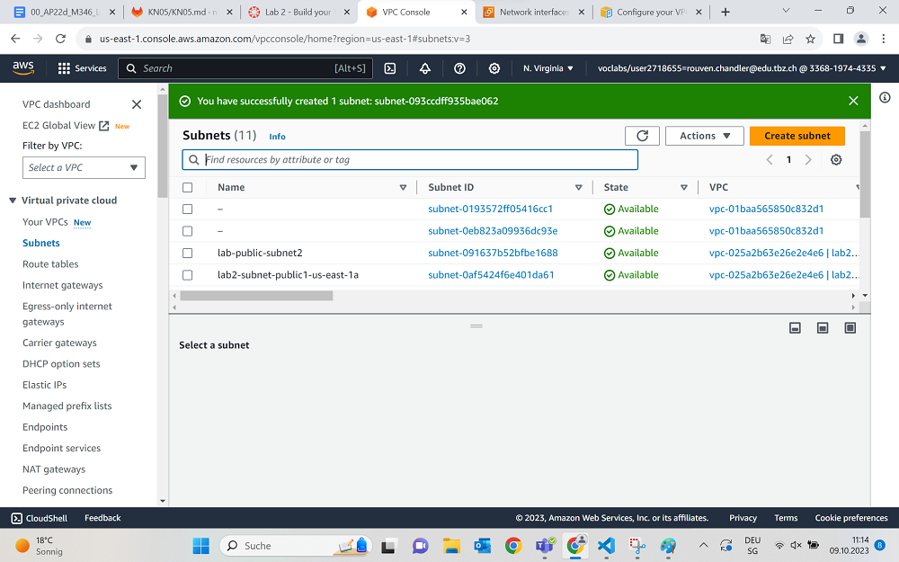
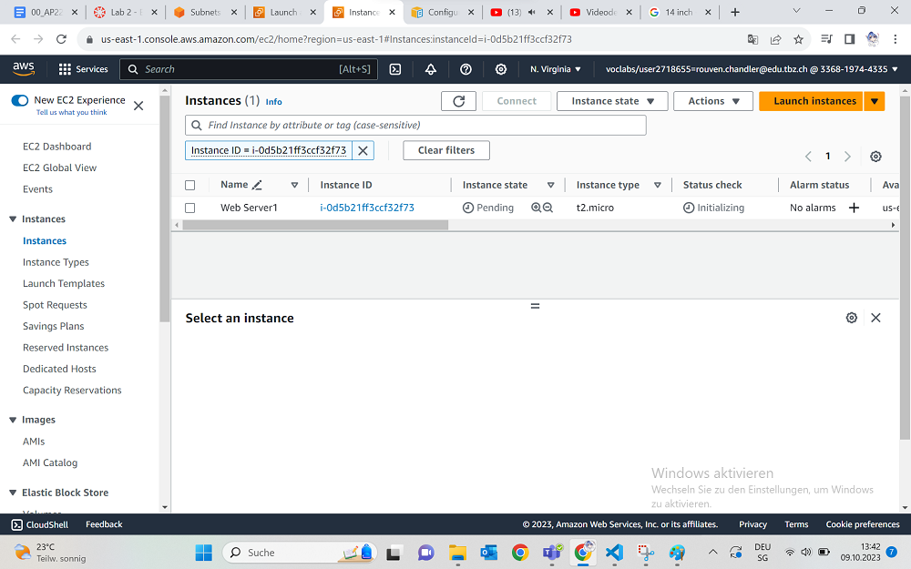
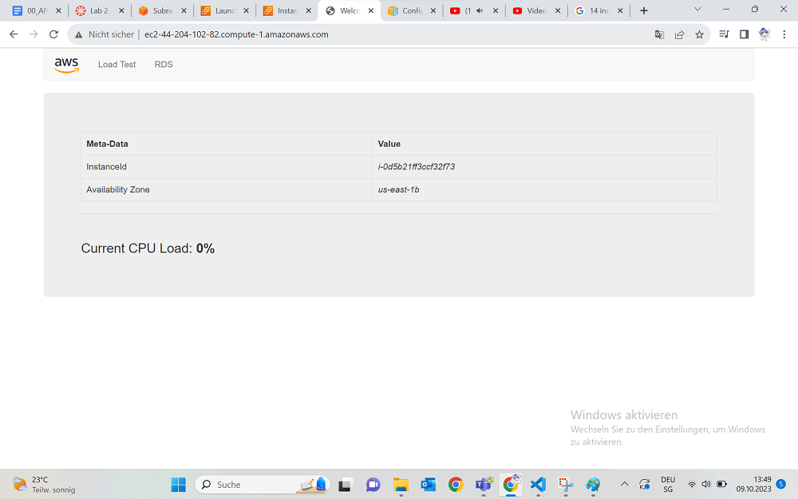
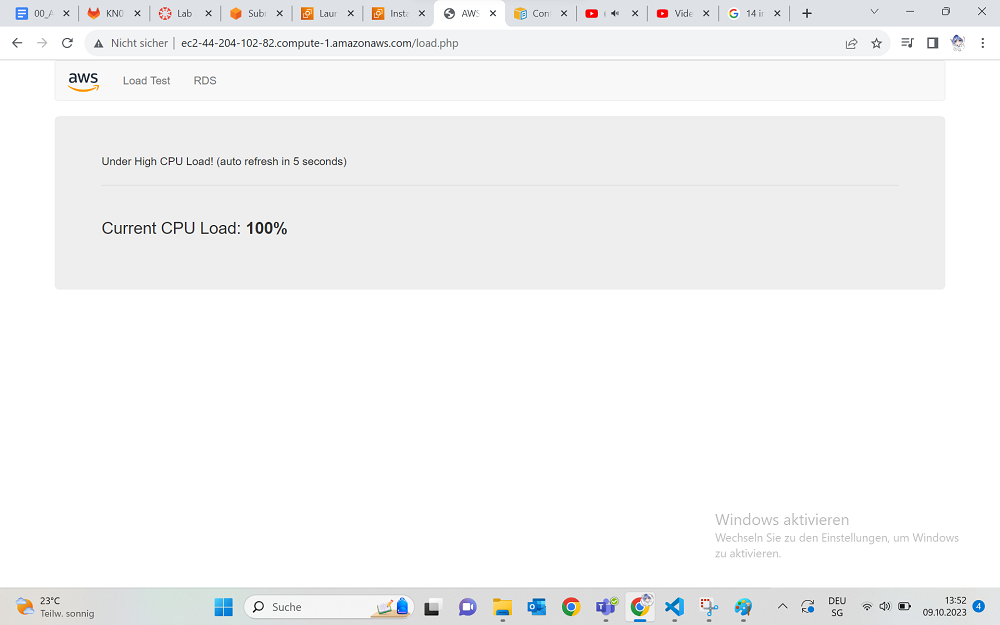
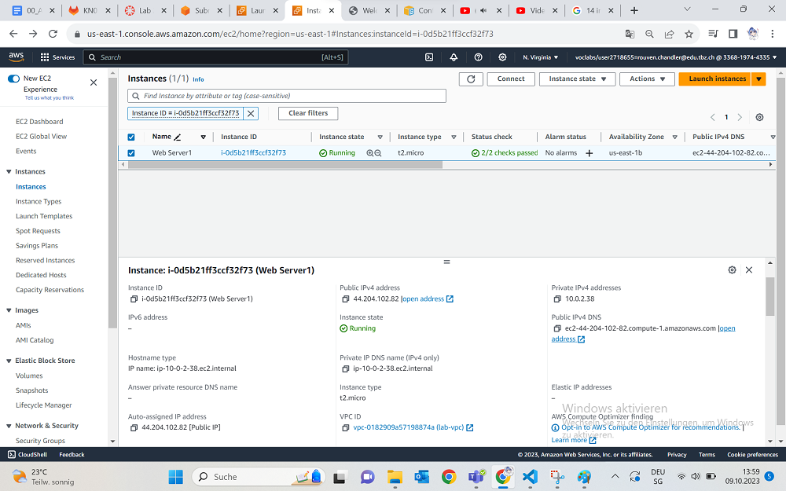

## Vorbereitung
Als erstes machen wir einen kleinen Umschwung zu einem anderen AWS Foundations Lab. AWS Academy Cloud Foundations [58603]

Heute benutzen wir kein EC2, S3 oder irgendeinen Service, den wir zuvor genutzt haben, sondern wir gehen auf die Service-9-Punkte Schaltfläche und suchen nach "VPC".
Oben Rechts müssen wir noch einmal checken, ob wir wirklich in Nord Virginia sind und createn unseren VPC.

Wir müssen konfigurieren:
+ VPC and more
+ Name tag auto-generation, Name = lab
+ IPv4 CIDR block = 10.0.0.0/16
+ Number of Availability Zones = 1
+ Number of public subnets = 1
+ Number of private subnets = 1
+ Public subnet CIDR block in us-east-1a = 10.0.0.0/24
+ Private subnet CIDR block in us-east-1a = 10.0.1.0/24
+ NAT Gateways = In 1 AZ
+ VPC Endpoints = none
+ DNS Hostpoint & DNS resolution = enabled

So, und jetzt sollte der VPC richtig eingestellt sein und wir können ihn aktivieren.
Jetzt können wir die Details anschauen von unserem VPC.

## Subnetz hinzufügen
Nachdem man einen VPC aufgesetzt hat, kann man immer noch Subnetze hinzufügen. Und wie das geht schauen wir uns heute an.

Als erstes suchen wir in der linken Taskleiste den Begriff "Subnets" und wählen ihn aus.
Als erstes erstellen wir ein public subnet, also drücken wir wieder ganz leicht auf den "Create Subnet"-Knopf.
Unsere Einstellungen sind:
+ VPC ID: lab-vpc
+ Subnet name: lab-subnet-public2
+ Availability Zone: 2. Option, zb us-east-1b
+ IPv4 CIDR block: 10.0.2.0/24

Dieses Subnetz wird alle IP Adressen besitzen die eine 2 an dritter Stelle haben.

Jetzt machen wir quasi das gleiche nochmals, nur als private Subnetz. Wir gehen also noch einmal auf die Schaltfläche "Create Subnet", und geben diese Einstellungen ein:
+ VPC ID: lab-vpc
+ Subnet name: lab-subnet-private2
+ Availability Zone: Das gleiche wie oben
+ IPv4 CIDR block: 10.0.3.0/24
  
Dieses Subnetz hat nun alle IP-Adressen im 3er Bereich.
Wir drücken auf "create" und unser Privates Subnetz wurde erstellt.

## NAT-Gateway
Unser Plan ist es jetzt dieses Private Subnetz im NAT-Gateway hinzuzufügen.
Jetzt wählen wir Links die Route Tables aus und selecten unser lab-rtb-private1-us-east-1a.
Dann gehen wir auf den Subnet-Association Tab und auf den editieren Button.

Wir selecten unsere neue Gruppe und gehen dann auf Saven.

Und wenn wir alles richtig gemacht haben, wird es funktioniert haben.

Das gleiche machen wir daraufhin auch mit dem Public Subnetz.

## Security Group
Hierbei erstellen wir eine Security Group, die wie eine Firewall funktioniert.
Dafür selecten wir wieder links die Security Groups und erstellen eine neue.
Unsere Konfigurationen bestehen aus:
+ Security group name: Web Security Group
+ Description: Enable HTTP access
+ VPC: remove current VPC and choose lab-vpc

Inbound Rules werden natürlich auch noch hinzugefügt:
+ Type: HTTP
+ Source: Anywhere-IPv4
+ Description: Permit web requests
Und nun können wir die neue Security Group erstellen.

## Instanzen
Nun testen wir natürlich diese Security Group mit einer EC2 Instanz, die wir starten werden. Die Optionen hierbei sind wieder folgende:
+ Name: Web Server 1
+ AMI: Amazon Linux
+ Amazon Linux 2023 AMI
+ Instanz type: t2.micro
+ Key pair: vockey

Network Settings:
+ Network: lab-vpc
+ Subnet: lab-subnet-public2
+ Auto-assign public IP: Enable
+ Select existing security group: Web Security Group

Als nächstes müssen wir unter UserData dieses kleine Skript einfügen, welches unseren kleinen php Web Server erstellt

~~~
#!/bin/bash
# Install Apache Web Server and PHP
dnf install -y httpd wget php mariadb105-server
# Download Lab files
wget https://aws-tc-largeobjects.s3.us-west-2.amazonaws.com/CUR-TF-100-ACCLFO-2/2-lab2-vpc/s3/lab-app.zip
unzip lab-app.zip -d /var/www/html/
# Turn on web server
chkconfig httpd on
service httpd start
~~~

Und dann können wir endlich unsere Instanz starten.
Und zack, schon existiert unsere Web Server Instanz.

Jetzt müssen wir nur noch warten bis die Checks durch sind und dann können wir fortfahren.

Jedenfalls, wenn das abgeschlossen ist, können wir die Instanz markieren und unten nach dem Public DNS suchen, die Seite aufrufen und aus dem https ein http machen und unser Resultat ist dieses hier:

## Nachweise
100% CPU Load:

Networking Tab:

## Quellen
+ Repository M346
+ AWS Foundation Lab
+ AMazon AWS Docs