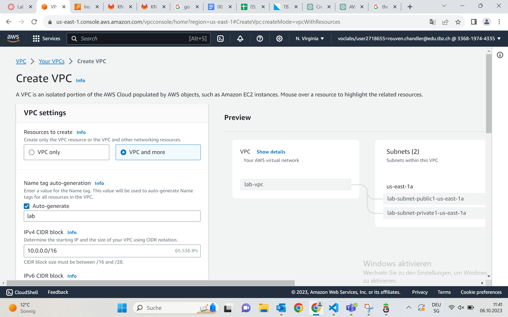

## Vorbereitung
Als erstes machen wir einen kleinen Umschwung zu einem anderen AWS Foundations Lab. AWS Academy Cloud Foundations [58603]

Heute benutzen wir kein EC2, S3 oder irgendeinen Service, den wir zuvor genutzt haben, sondern wir gehen auf die Service-9-Punkte Schaltfläche und suchen nach "VPC".
Oben Rechts müssen wir noch einmal checken, ob wir wirklich in Nord Virginia sind und createn unseren VPC.

