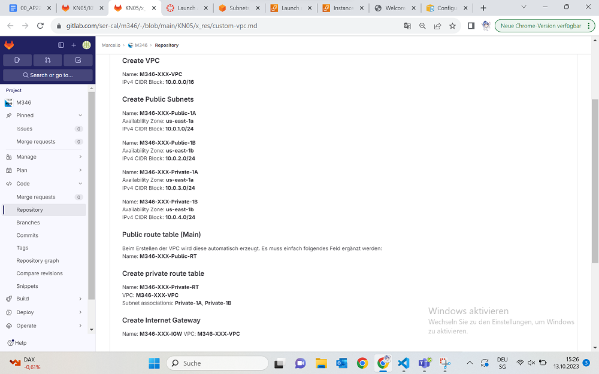
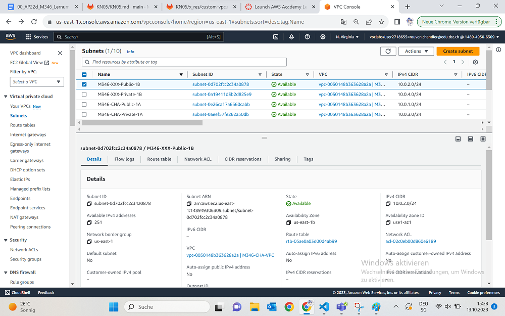
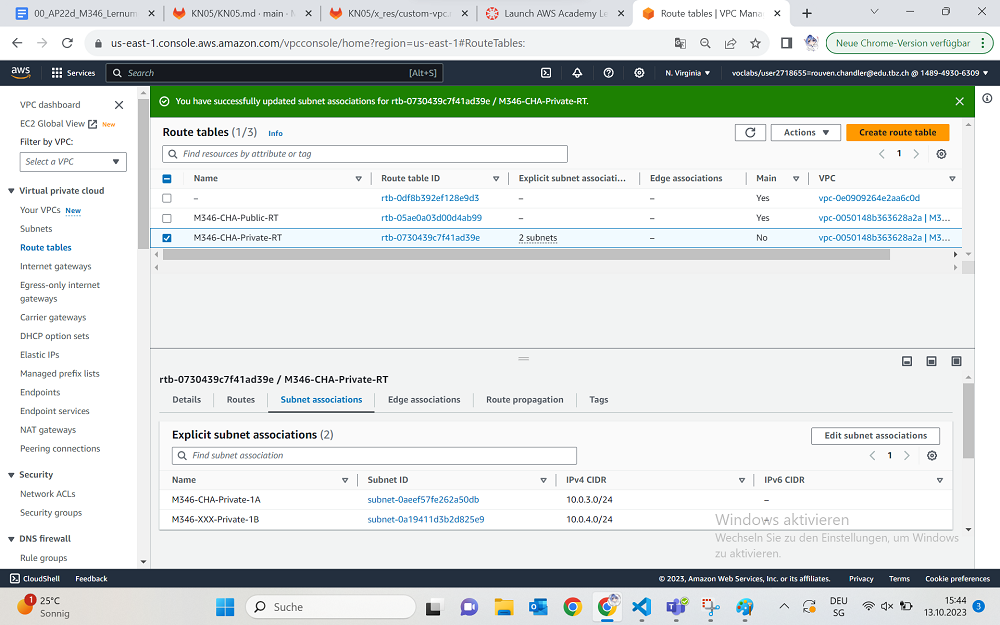
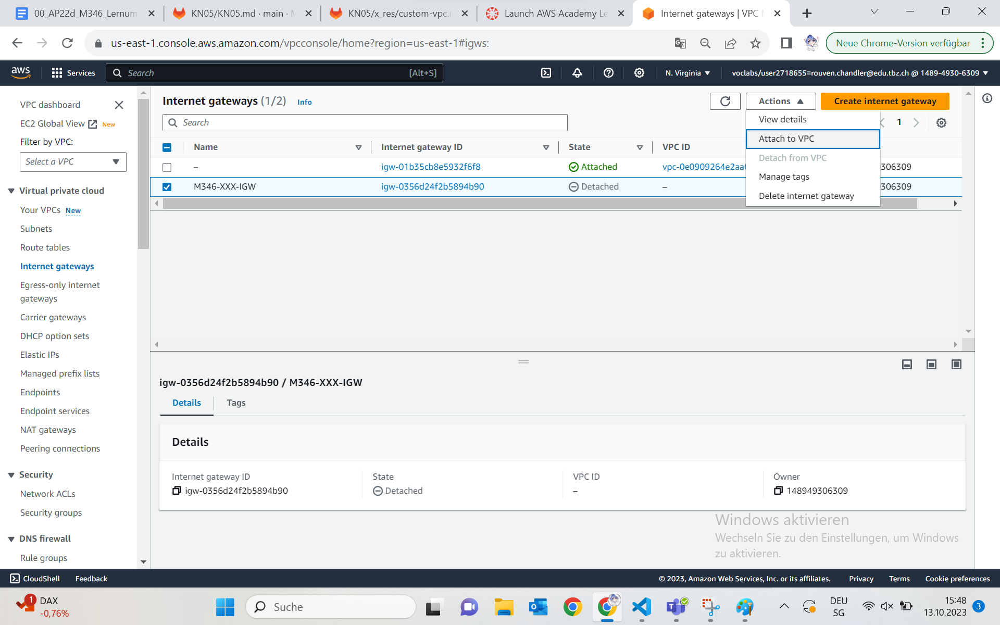
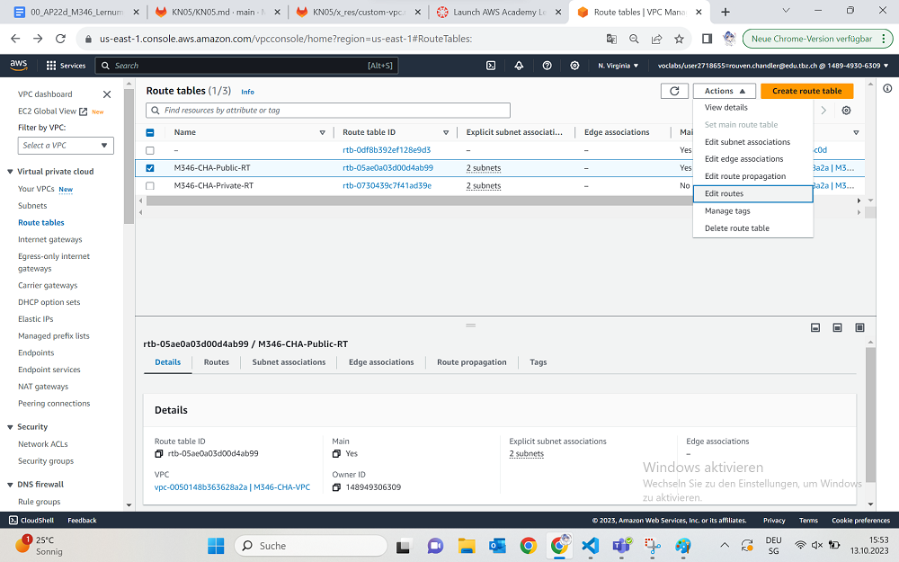
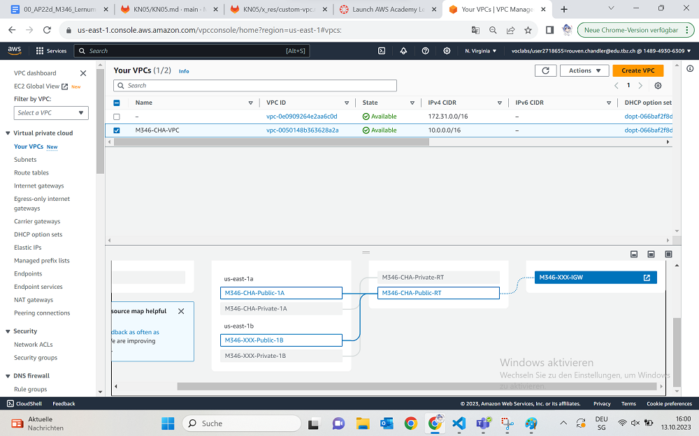
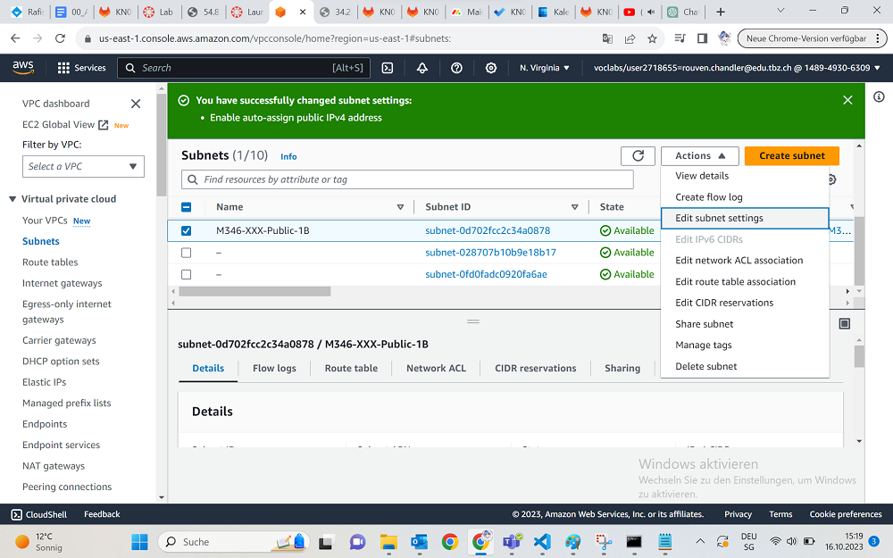

## Vorbereitung
Als erstes gehen wir zurück in unser Learner Lab. Dort erstellen wir wieder einen VPC mit dem Namen: M346-CHA-VPC

Hier sind die genauen Anforderungen, die wir beachten müssen beim erstellen unseres VPCs.

Das erstellen der Subnetze ist ebenfalls sehr sehr leicht, das haben wir eigentlich alles schon in der Aufgabe A gemacht, so soll es aussehen in der Konfigurierung und wir gehen weiter. Nützlich zu wissen ist, dass man auch 2 Subnetze aufs mal erstellen kann nach Bedarf.

Route Tables werden erstellt und mit den jeweilligen Subnetzen verbunden. Hierbei muss man aufpassen, ein Route Table existiert bereits und muss nur noch umbenannt werden. Und natürlich die Subnetze müssen hinzugefügt werden.

Unser Gateway erstellen wir auch sehr schnell und können unter "Actions", "Attach VPC" wählen um unseren VPC mit dem Gateway zu verbinden.

Zu guter Letzt müssen wir noch den RouteTable mit dem Gateway verbinden. Alle Pakete die nicht zum 10.0.0.0/16 Netz gehören, sollten in den Gateway weitergeleitet werden. Das machen wir indem wir zu unserem Public Route Table gehen, auf "Edit Routes"

Wir erstellen eine neue Destination mit dem Netz "0.0.0.0/16" und wählen im Target den Internet Gateway aus und darunter die ID, die wir davor erstellt haben.

Wenn wir jetzt nachschauen, ist unser Gateway mit dem VPC wunderbar verbunden.

Unfassbar wichtig für nächste Schritte ist auch noch die Anpassung der Auto-Zuweisung für die IPv4 Adressen im Subnetz.
Dafür gehen wir in den Reiter "Subnetz" und wählen unser Public Subnetz aus. (Für das andere wiederholen)
Dann gehen wir auf "Subnetz Settings"

Da aktivieren wir Auto-Assign IPv4 Adressen.

## Quellen
+ M346 Repository