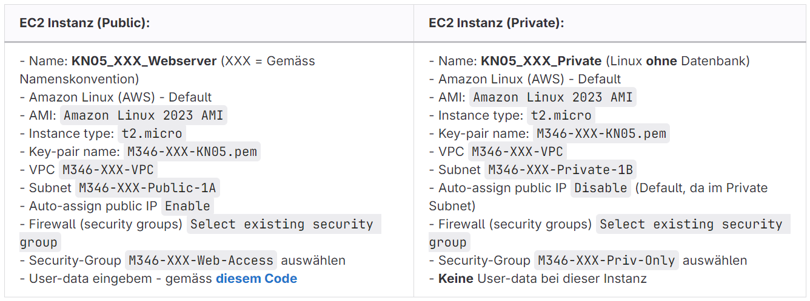
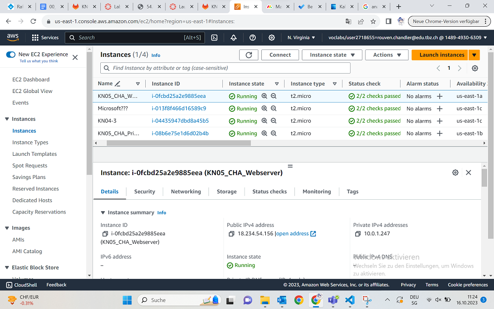
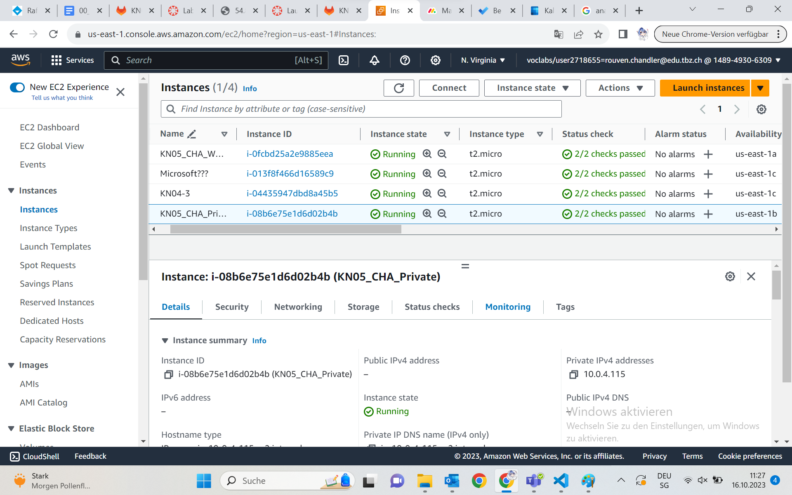

## Vorbereitung
Um die Instanz perfekt ausführen zu können, machen wir ein paar Einstellungen bevor wir die neue Instanz erstellen.

Die erste Security Group trägt den Namen: M346-CHA-Web-Access und hat die Inbound Rules zu SSH und HTTP.
Die zweite Security Group heisst: M346-CHA-Priv-Only und hat ICMP für den Ping und je nach Wahl auch SSH.
Wichtig ist hierbei, dass unser VPC ausgewählt ist und 

## Instanz erstellen
Wir erstellen einerseits eine öffentliche Instanz und eine private Instanz. Dies machen wir aufgrund des Subnetzes, da wir 2 haben wollen.
Das sind die Anforderungen hier:

Unser Code ist wieder das hier, was einfach einen Apache Webservice aufsetzt.
~~~
#!/bin/bash
yum update -y
yum install -y httpd
systemctl start httpd
systemctl enable httpd
~~~

## Testen
Jetzt testen wir ob unsere Instanzen funktionieren. Dazu müssen wir erst einmal den Gateway überprüfen.
Als Beweis, dass unsere Instanzen im richtigen Subnetz sind, müssen sie mit 10.0.X.X anfangen. Je nachdem ob es der Webserver ist, steht dort eine 1 oder eben bei der Privaten Instanz, dort steht eine 4.

So und da nun dies klar ist, können wir versuchen mit vielen Methoden unsere Instanz zu erreichen.
Als allererstes versuchen wir per Browser auf den DNS zu gelangen.

Naja ich hab zwar alles genaustens so gemacht wie die Anleitung beschrieben hat, aber die Verbindung konnte nicht gefunden werden, egal wie sehr ich nach Fehlern gesucht habe.