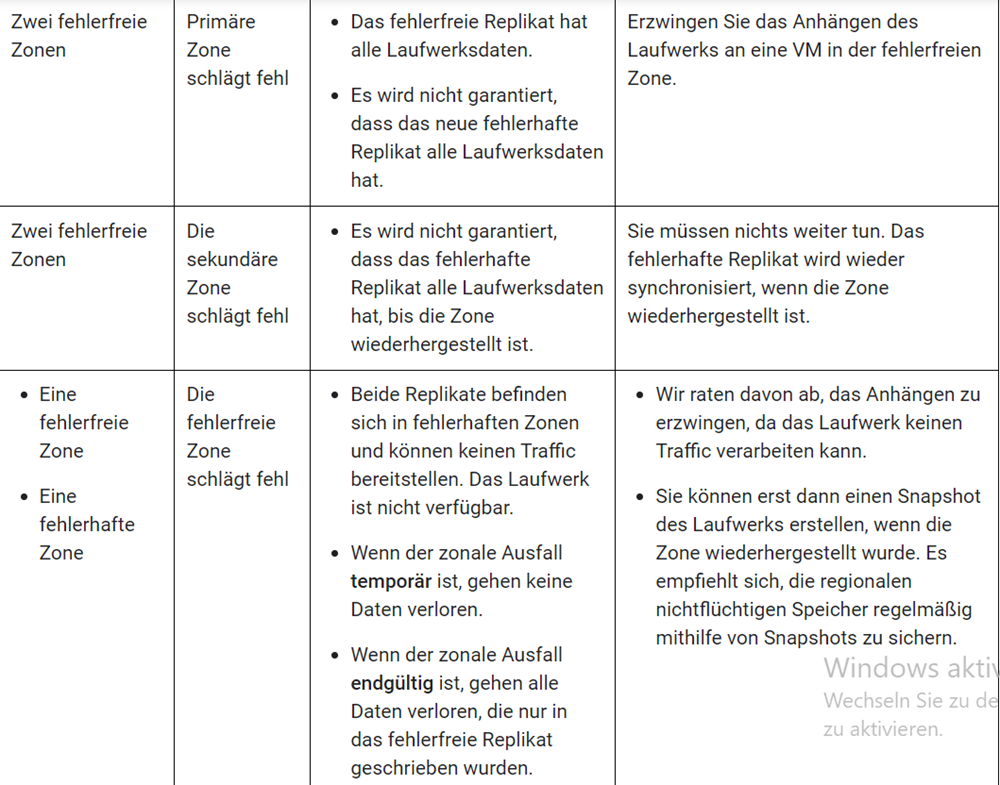
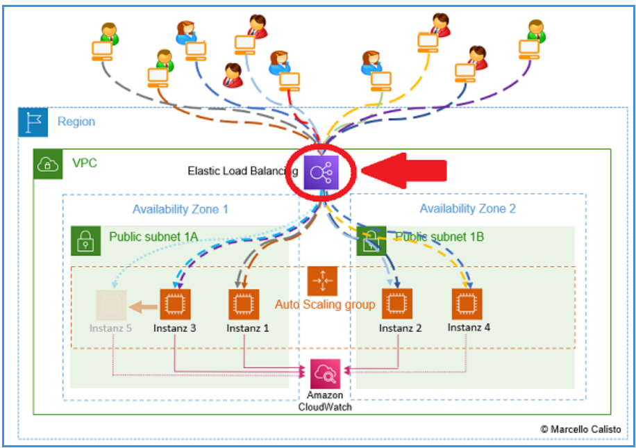

# High Availability
High Availability wird dadurch geschaffen, dass der Server 24/7 verfügbar ist. Gute Availability Services schaffen es 99,997% vom Jahr online zu sein. Die paar Stunden kommen durch ungewisse Zusammenfälle zustande. Um diese Quote aufrecht zu erhalten, gibt es verschiedenste Warnungssoftware die sehen kann, wenn ein Ausfall droht und die Aufgabe hat, diesen Ausfall zu verhindern, durch migrieren in eine andere Zone oder eine andere Instanz. Automatische Fehlererkennung spielt auch eine Rolle, wo ein Fehler automatisch erkannt wird und im best Case durch vorprogrammierte Cases auch direkt behoben werden kann.

## Erdbeben??
Bei einem Erdbeben werden die Daten so schnell wie möglich komplett auf einen anderen Server migriert, um die verlorenen Server zurückzulassen. Dabei sollten so wenig Daten wie möglich verloren werden.

## Stromausfall??
Bei einem Stromausfall würde ich schätzen, hat der Server keine Zeit mehr zu erkennen, dass plötzlich keine Energie mehr da ist. Deswegen existieren andere Server, die dies erkennen und mit der Situation umgehen können. Dadurch dass ein erheblicher Teil der Server fehlt, müssen diese Server so schnell wie möglich wieder aktiviert werden, da sonst viel Leistung "verloren" geht. Zumindest während dem Stromausfall. Mit Backups kann man aber eine temporäre Lösung schaffen, die für den Moment die ganzen Server übernehmen, bis die Hauptserver wieder einsatzbereit sind.

# Fault Tolerance
Das ist quasi die Erkennung und Isolierung von Fehlern, damit der Rest weiterlaufen kann. Das ist wie bei einer Computer Infrastruktur wo verschiedene Computer in einem Sternensystem am Router oder Switch angeschlossen sind, und wenn ein PC stirbt können die anderen durch die weiteren Stränge weiterfahren. Der Vergleich funktioniert zwar nur oberflächlich, aber es ist im Prinzip das gleiche.

Damit wir die Fault Tolerance verbessern können, bauen wir zb einen Load Balancer ins System ein, dass bei einer kaputten toten Instanz, direkt auf die 2te gewechselt werden kann ohne Probleme.

Redundanz bedeutet die Verteilung, verschiedener Server auf verschiedene Locations. Heisst wenn Server A in Los Angeles einen Stromausfall hat, wird automatisch auf eine exakte Kopie gewechselt, die in Washington steht.

Failzones wechselt die Zonen aus, die langsam sind oder nicht funktionieren. Ist hier eigentlich ganz gut beschrieben:

## Kleinfirma
In einer Kleinfirma hat man natürlich nicht diesselben Möglichkeiten wie bei einem Titan wie Amazon Web Services. Geografische Verteilung fällt auf jeden Fall weg, da die Chancen für ein Erdbeben es sich Wert sind, einen kompletten zweiten Backupstandort aufzumachen. Am besten wäre es, Failzones einzuberechnen, da die intern im Server geregelt werden können statt einen zweiten Server zu kaufen.

# Load Balancer
Der Load Balancer managed den ganzen Traffic der auf die Seite kommt. Wenn die Instanz A überlastet ist, wird automatisch auf die Instanz B gewechselt. Automatisch können keine Instanzen aufgemacht werden, deswegen ist der Load Balancer auf die Instanzen angewiesen die bereits existieren. Der Load Balancer ist ein extrem gutes Tool um die Availability zu verbessern, da sogesehen die doppelte Anzahl an Usern zugreifen kann, mit jeder neuen Instanz die in Betrieb genommen wird.

## Typen
Es gibt als erstes die **Elastic Load Balancer (ELB)**. Dieser Name beinhaltet 2 Load Balancer Typen. Einerseits den **Application Load Balancer (ALB)**. Dieser ist zuständig den Traffic vom HTTPS und HTTP zu managen. Dann der andere den **Network Load Balancer (NLB)**, welcher dazu da ist um den Traffic von TCP, TLS und UDP zu managen. Er ist gut skalierbar.

Dann gibt es die **Classic Load Balancer**. Diese älteren Versionen haben beide Versionen des oberen in einem. Empfohlen werden aber die oberen.

Der **Gateway Load Balancer** darf natürlich auch nicht fehlen. Designt um third party Tools zu managen wie Firewalls, prevention Systems und Deep Packet Inspectors.

Zu guter letzt ist noch der **Global Accelerator**. Dieser operiert mit der IP und sorgt dafür, dass der Route Traffic opitmal und flüssig funktioniert.

## Load Balancer + Autoscaler
Eine sehr gute Kombi die beiden. Der Autoscaler kann automatisch Instanzen erstellen und der Load Balancer kann dann auf diese Zugreifen um eben den Traffic umzuleiten. 

## DDos Angriffe
Um DDos Angriffen Standzuhalten, ist es das beste, eine Firewallähnliche Einstellung zu tätigen, um den Bots direkt den Weg zu versperren überhaupt auf die Seite drauf zu kommen.

## Leistung überwacht?
Das kann mit einem Cloud Watcher überprüft werden. Das ist so wie ein Bewacher im Gefängnis, welcher das Gelände und die Häftlinge im Blick hat und permanent Dokumentiert. Naja jedenfalls überprüft er wie die Instanzen laufen und welche gerade an sind.

# Auto Scaling
Auto Scaling, arbeitet mit dem Cloud Watcher zusammen, und sobald dieser findet "Wir haben zu wenig Instanzen!" dann kommt der Autoscaler ins Spiel und erstellt eine neue Instanz aufgrund eines Templates, was die generellen Instanz Einstellungen beinhaltet. Durch dieses System ist der Autoscaler in Kombination mit dem Load Balancer sehr stark, da komplett dynamisch die grösse angepasst werden kann und auf Bedarf auch wieder herunterskaliert werden kann und Instanzen ausser Betrieb genommen werden.

## Arten
Es gibt den normalen **Amazon EC2 Auto Scaling**, welcher die Anzahl an Instanzen managed.
Es gibt den **Application Auto Scaling** welcher EC2 Sachen "beyond" der Instanz managed.
Es gibt den **AWS Elastic Beanstalk Auto Scaling** welcher PaaS und WebServer Management betreibt.
Den **Amazon RDS Auto Scaling** managed die relationale Datenbank, indem sie Replicas lesen oder erstellen.
Den **Amazon Aurora Auto Scaling** ebenfalls etwas ähnliches, welches die Amazon Aurora Datenbank managed.
Und als letztes den **AWS Fargate Auto Scaling** welcher eine Serverlose Computer Engine für Container ist.Auto Scaled Workloads und Ressourcen von Containern.

# Quellen
- ChatGPT
- Julie
- Hr. Callisto