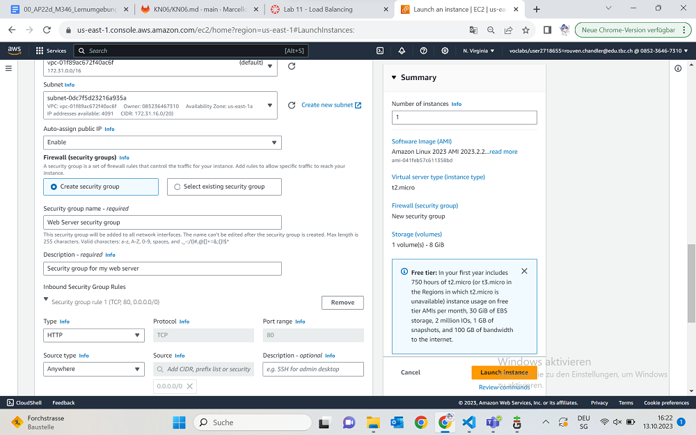
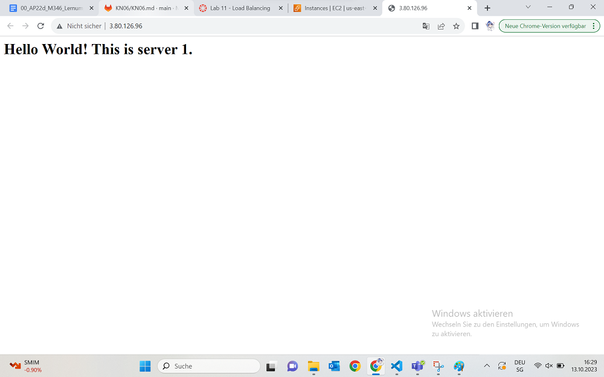
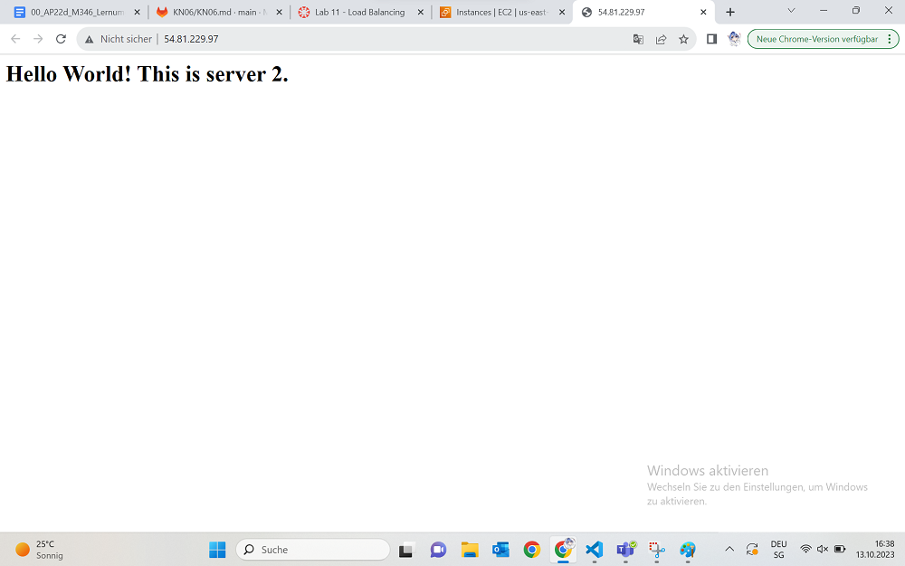
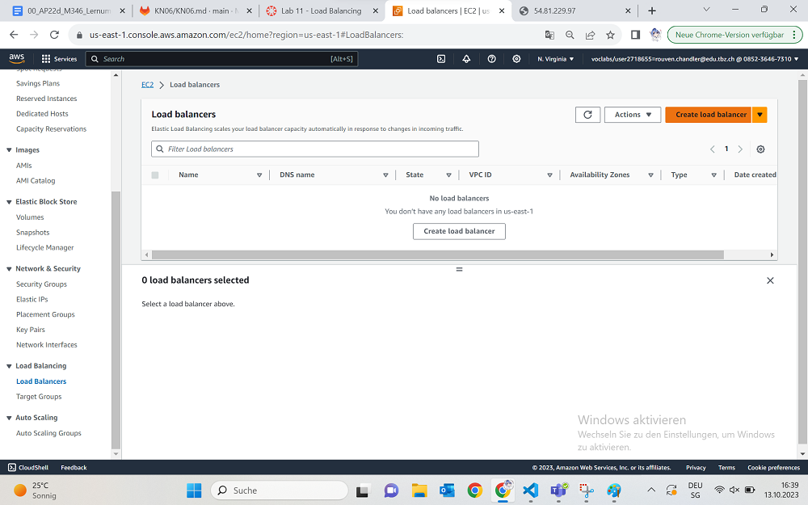
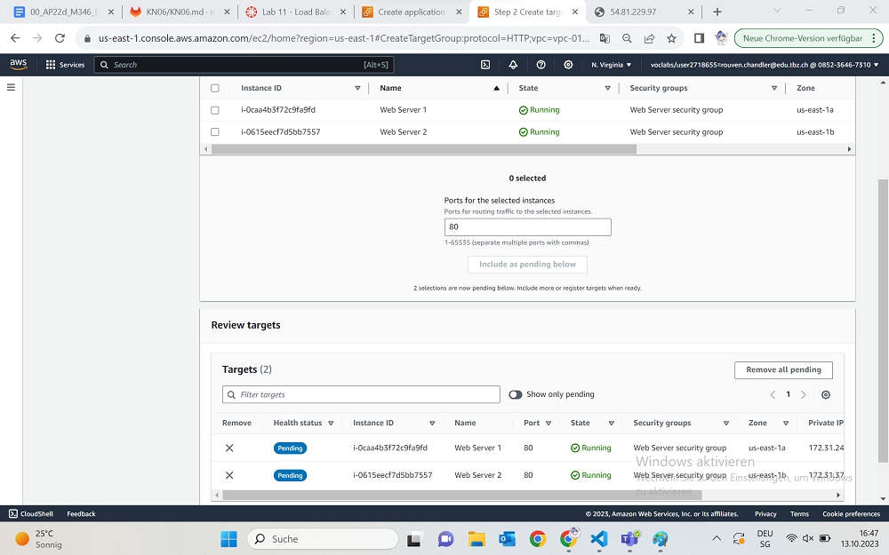
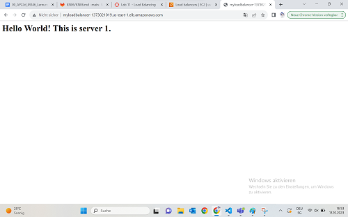
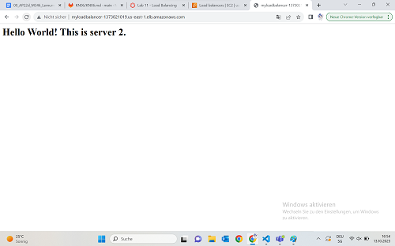

Hier arbeiten wir wieder im AWS Introduction Kurs, im "Module 11 - Load Balancers and Caching".

## Instanz launchen
Als allererstes starten wir wieder eine EC2 Instanz. Unser Name heute ist wieder einmal "Web Server 1" und wir behalten die Amazon Linux OS. Wir wählen eine t2.micro Instanz aus und als Key Pair benutzen wir den "vockey" key. Die Network Settings bearbeiten wir hier: Wir wählen ein existierendes Subnetz aus der Region "us-east-1a" aus, unsere neue Security Group nennen wir "Web Server security group" und als Beschreibung schreiben wir das da hin: "Security group for my web server". Die Inbound Rules removen wir alle beide und fügen dann wieder eine Security Group Rule hinzu: HTTP. Source: Anywhere. Am Ende sollte das alles in etwa so aussehen:

In unser UserData Feld machen wir diesen Code hier rein:

~~~
#!/bin/bash
yum update -y
yum -y install httpd
systemctl enable httpd
systemctl start httpd
echo '<html><h1>Hello World! This is server 1.</h1></html>' > /var/www/html/index.html
~~~

Dieser Updated den Server, installiert einen Apache Webserver (httpd) und macht eine kleine simple Webseite.
Nun, da wir jetzt unsere Instanz haben, können wir versuchen per IP-Adresse auf den Webserver zu kommen. Wenn alles funktioniert hat, sieht die Seite so aus:

## Zweite EC2 Instanz
Jetzt erstellen wir eine zweite EC2 Instanz, indem wir zuerst unsere alte auswählen, dann vom Action Menu aus "Images and templates" auswählen und dort "Launch more like this" anwählen.

Von hier aus nennen wir unsere Instanz um in "Web Server 2", wir wählen erneut das "vockey" Key Pair aus und unser Subnetz hat dieses mal eine Availability Zone von us-east-1b.

Diesmal ist das hier unser Skript:

~~~
#!/bin/bash
yum update -y
yum -y install httpd
systemctl enable httpd
systemctl start httpd
echo '<html><h1>Hello World! This is server 2.</h1></html>' > /var/www/html/index.html
~~~

Im grossen und ganzen dasselbe, nur dass hier "server 2" steht, statt Web Server 1. Oder was ich oben jedenfalls im Skript hatte.

Dies wird ebenfalls dann wieder gelauncht.

Wir versuchen erneut die Instanz per IP-Adresse zu bekommen und wir werden zu einer Seite weitergeleitet mit dem Text aus unserem Skript.

## Load Balancer hinzufügen
In der EC2 Konsole links, sollte ein Abschnitt stehen mit dem Wort "Load Balancer". Da drücken wir drauf, hin zum "Application Load Balancer", erstellen direkt etwas neues und geben den glorreichen Namen: "myloadbalancer".

Im "Network Mapping" Panel, wählen wir unsere beiden Avalability Zonen aus, auf denen wir unsere Instanzen laufen lassen. In unserem Fall wäre das us-east-1a und 1b.

Die Security Gruppe ist ebenfalls die gleiche die wir am Anfang ausgewählt haben und im "listening und Routing"-Panel, erstellen wir eine neue target Group. Wir geben ihr den Namen "myalbTG" und fügen im "health check" /index.html ein.

Im nächsten Fenster wählen wir unsere beiden Instanzen aus und Includen beide als Pending.

Und jetzt erstellen wir die Gruppe. Und können auf dem Ursprünglichen Screen diese auswählen. Nachdem wir gereloadet haben, aber das ist wahrscheinlich klar. Nun haben wir alles gemacht und können den Load Balancer erstellen.

Wenn wir auf "View Load Banner" drücken, kommen wir schneller an unseren Ort und warten kurz ab, bis er aktiv wird.

## Load Balancer testen
Wenn unser Load Balancer "active" geworden ist, können wir ihn testen. Dazu gehen wir in die "Details" hinein (Load Balancer selecten davor und dann unten), da kopieren wir den DNS und fügen ihn in einer neuen Webseite ein. Wenn alles funktioniert hat, wird jetzt immer abgewechselt zwischen Server 1 und Server 2 um Ladezeiten zu vertuschen.

## Quellen
+ AWS Introduction Kurs