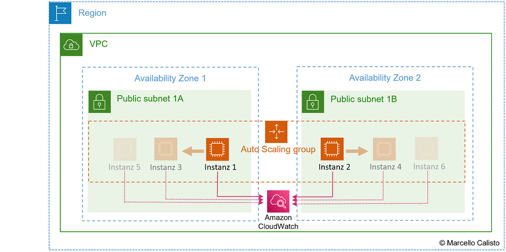
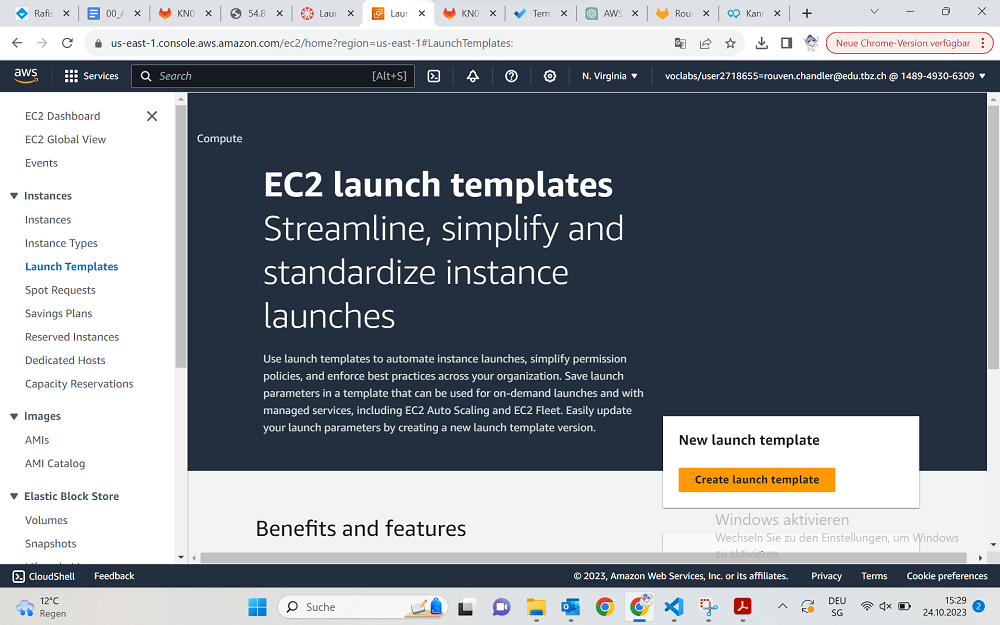
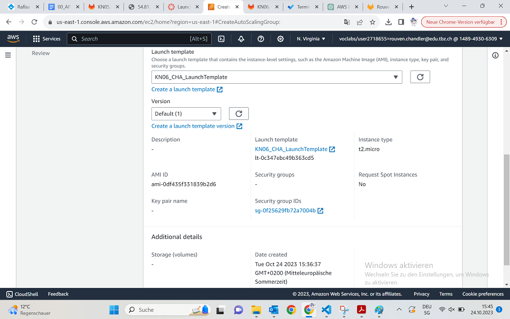
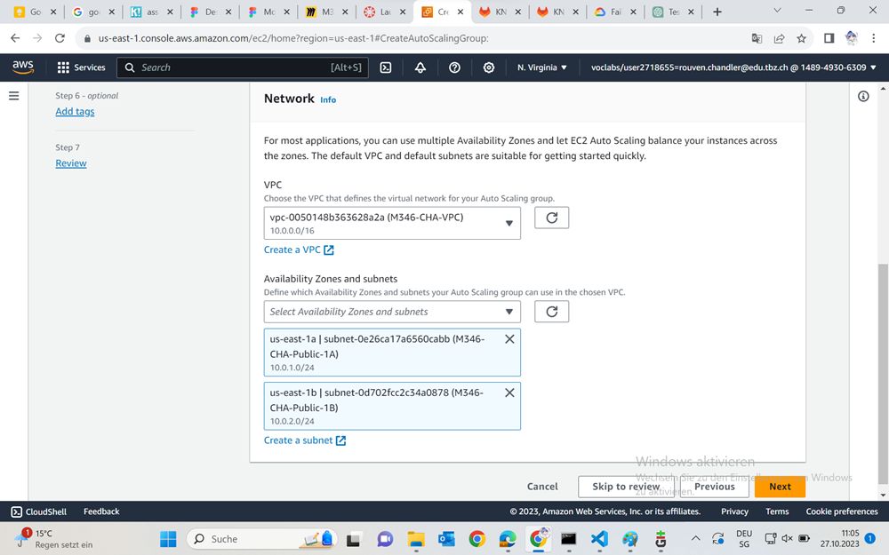
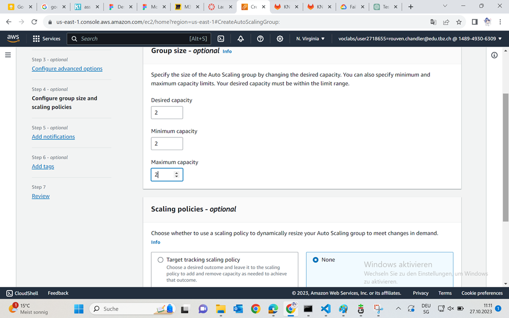
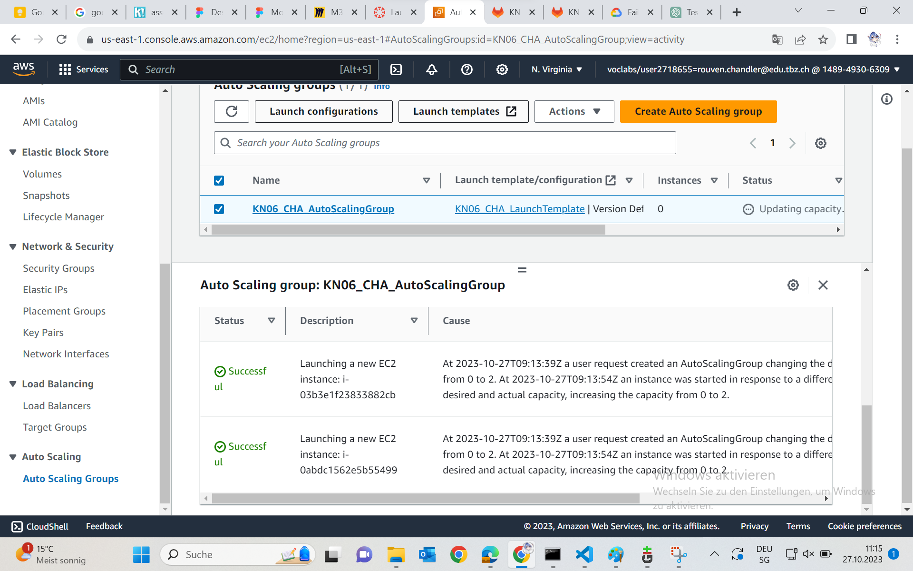
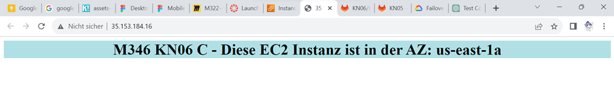
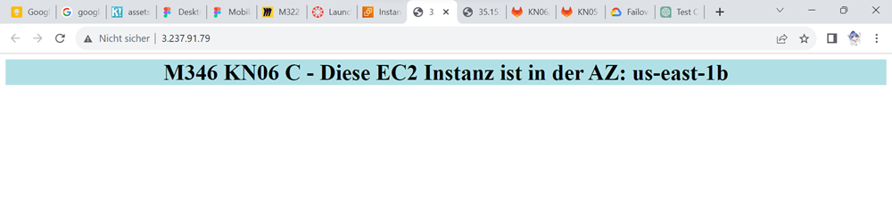

## Warum braucht es einen Auto Scaler?
Dos Attacken sind bekannte Cyberattacken, welche einen Server lahmlegen wollen durch hohe Datenzufuhr. Der Load Balancer den wir gemacht haben mag zwar für Benutzer reichen um die Last zu stoppen, aber für eine Dos Attacke braucht es schon mehr. Da kommt der AutoScaler ins Spiel. Dieser ist eine Applikation aus dem Security Bereich und wird dafür sorgen, dass unsere Instanzen kein Problem mit Datenüberfüllung haben werden.
Er wird erst aktiviert, wenn mit dem System etwas nicht stimmt.

## AutoScaler Funktionen
+ Launchen und terminieren von EC2-Instanzen dynamisch.
+ Horizontal skalieren (Scale out).
+ Unterstützt Elasticity und Scalability.
+ Reagiert auf EC2 Status Checks und CloudWatch-Metrics.
+ Skaliert On-demand (Performance) und/oder gemäss Planung (Falls man z.B. weiss, dass am Sonntagabend ein Backup-Job viel Ressourcen braucht).

## Vorbereitung
Als erstes werden wir für unsere Instanzen ein sogenanntes "Launch Template" verwenden. Unser Ziel am Ende wird es sein automatisch Instanzen zu erstellen, deshalb brauchen wir dafür auch ein Template.

Dafür gehen wir in der Seitenleiste bei den Instanzen auf "Create Launch Template" und fangen an.

Unsere Daten hierfür wären:
+ Template Name - KN06_CHA_LaunchTemplate
+ Operating System - Amazon Linux 2023 AMI (AWS)
+ Instanz Typ - t2.micro
+ Key Pair - Keins
+ Subnetz - Keins
+ Security Group - M346-CHA-Web-Access

Und zu guter Letzt wird dieses Skript noch bei der Userdata eingefügt:
~~~
#!/bin/bash
yum update -y
yum install -y httpd
systemctl start httpd
systemctl enable httpd
EC2AZ=$(TOKEN=`curl -X PUT "http://169.254.169.254/latest/api/token" -H "X-aws-ec2-metadata-token-ttl-seconds: 21600"` && curl -H "X-aws-ec2-metadata-token: $TOKEN" -v http://169.254.169.254/latest/meta-data/placement/availability-zone)
echo '
<h1 style="background-color:powderblue;">M346 KN06 C - Diese EC2 Instanz ist in der AZ: AZID </h1>
' > /var/www/html/index.txt
sed "s/AZID/$EC2AZ/" /var/www/html/index.txt > /var/www/html/index.html
~~~
"Aus den Metadaten wird der Name der Availability Zone ausgelesen. Dieser Wert wird der Environment-Variable EC2AZ zugewiesen. Damit wir für diesen Befehl auch die notwendige Berechtigung haben, wird auf der gleichen Kommandozeile ein Token generiert und anschliessend direkt genutzt.
Dann wird eine einfache Zeile mit HTML erstellt: mit dem Hinweis, in welcher Availability Zone die aktuelle Instanz läuft. Dafür nutzen wir vorerst den leeren Platzhalter AZID. Diese Zeile wird in das Textfile /var/www/html/indext.txt gelegt.
Damit der Webserver diesen HTML-Content korrekt - und vor allem mit dem Namen der richtigen Availability Zone - darstellen kann, wird in der letzten Zeile mit dem Kommando sed der Platzhalter AZID mit der Variable $EC2AZ ersetzt. Zudem wird das Textfile in ein index.html-File umgewandelt."

## Auto Scaling Group
Nachdem wir unser Instanz-Template erstellt haben, kommen wir noch zur Auto Scaling Group.
Dies ist ebenfalls wieder sehr leicht getan, links Navigation unter "Auto Scaling" und dort erstellen wir das Template.
Die Optionen sind:
+ Name - KN06_CHA_AutoScalingGroup
+ Launch Template - KN06_CHA_LaunchTemplate

..und das war es schon. Ansonsten ändern wir hier nichts mehr.

Als nächstes müssen wir unter "Network" unseren VPC angeben + die Public Subnetze

Als nächstes müssten wir den Load Balancer auswählen und bestätigen
Einen Load Balancer haben wir in dieser Aufgabe noch nicht. Demnach werden wir diesen Step nicht verändern.
Den Rest unten können wir auch überspringen.

Dann sind wir bei der Grösse angekommen. Unsere gewünschte Anzahl Instanzen erhöhen wir auf 2, die Minimums- und Maximumsgrösse ebenfalls.
Eine Scaling Policy brauchen wir nicht.

Danach Createn wir unseren Auto Scaler!

Nun können wir direkt beobachten, dass automatisch 2 Instanzen gelauncht wurden.
(AutoScaling Groups -> Auswählen -> History -> herunterscrollen)

## Überprüfen
Wenn wir alles richtig gemacht haben, sollte die erste Instanz in der Availability Zome 1a sein und die zweite in der Zone 1b. (Die Markierten Namenlosen sind die die erstellt wurden)

Wenn wir jetzt auf die Public IP von unseren Instanzen gehen, sehen wir eine Webseite die auf die Instanzen zugeschnitten sind.

## Quellen
- Repository M346
- Google.com