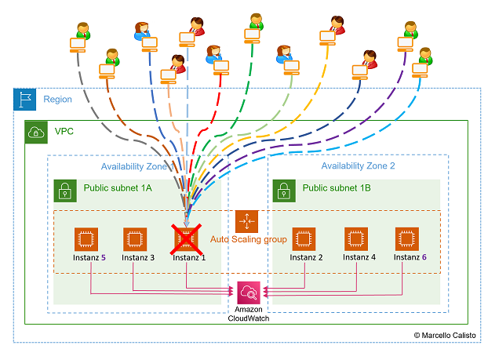
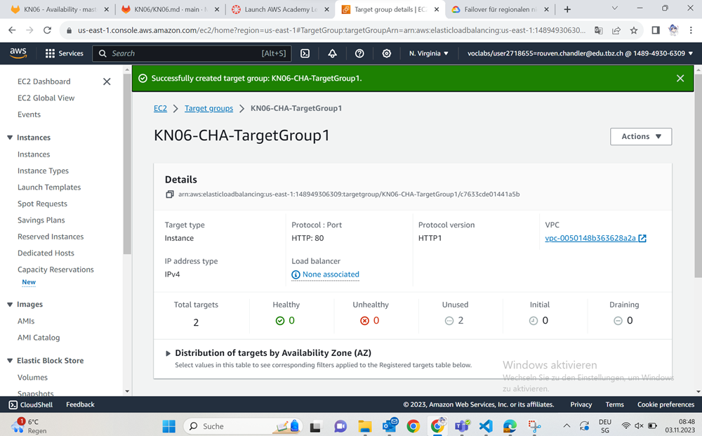
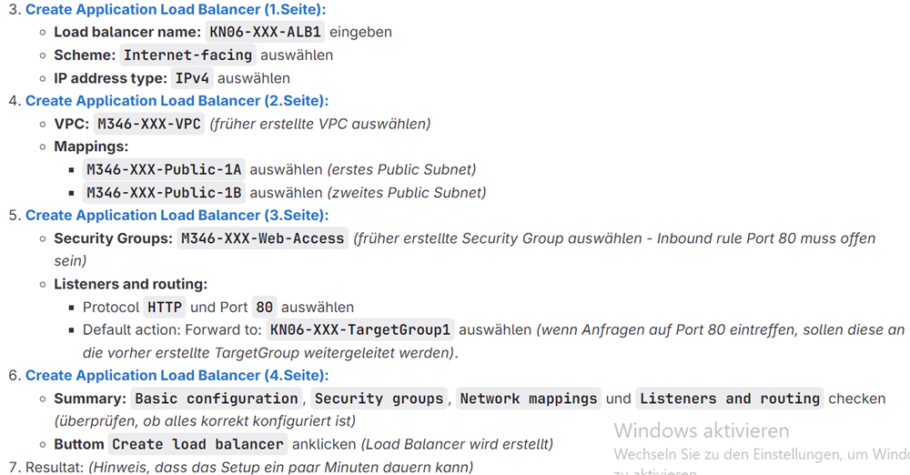

## Warum bringt ein AutoScaler alleine wenig?
Der AutoScaler funktioniert alleine nicht wirklich gut. Ein Load Balancer ist zwingend wichtig, weil ansonsten der AutoScaler immer weiter neue Instanzen erstellt, diese aber nicht eingesetzt und benutzt werden, da der AutoScaler dies nicht kann. Ich finde die Grafik verbildlicht das sehr gut.

## Einstellung
Als allererstes wählen wir in der linken Navigation unter LoadBalancer "Target Group" aus. (EC2)
Hier erstellen wir unsere Target Group mit folgenden Einstellungen:

Wenn wir unsere Target Group erstellt haben, sehen wir, dass noch kein Load Balancer zugeteilt wurde.

Diesen werden wir nun hinzufügen.
Das sind die Konfigurationsschritte beim LoadBalancer:

Jetzt haben wir einen LoadBalancer erstellt!
Diesen müssen wir jetzt mit unserem AutoScaler connecten, damit wir unser Konzept der Beiden umsetzen können.

Wir wählen wieder in der Navigationsbar "AutoScalin" "AutoScalingGroups" aus. Dann klicken wir auf unsere erstellte drauf.
Wir scrollen nach unten bis "LoadBalancer" und editieren ihn.

Wir müssen ein Haken in den Bereich "Application, Network or Gateway Load Balancer target groups" setzen und unser Load Balancer auswählen. Dann können wir auch schon weitergehen.