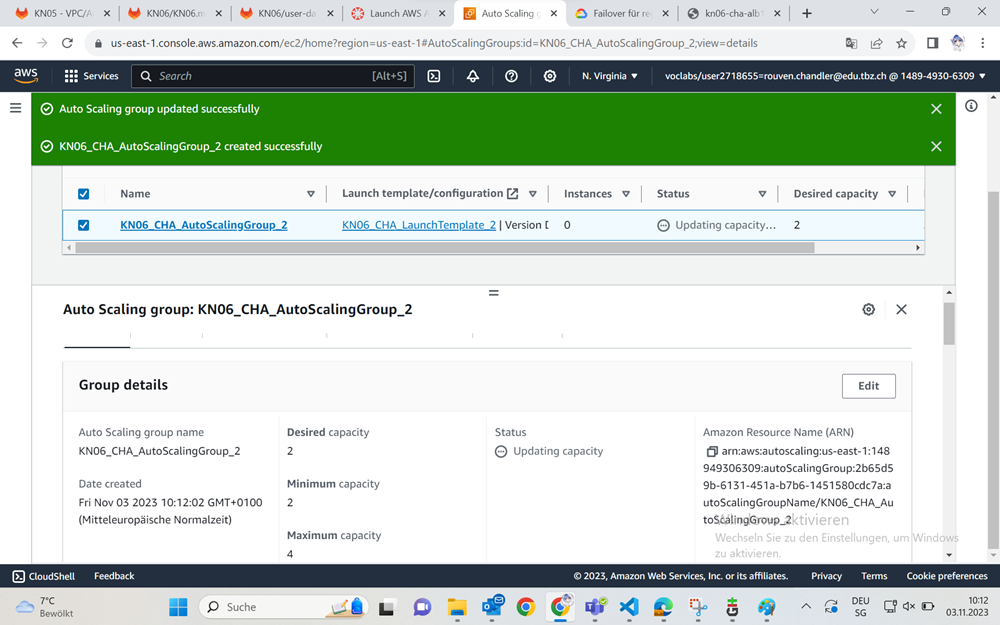
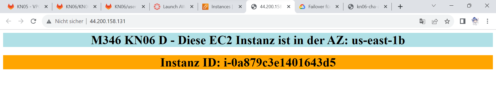
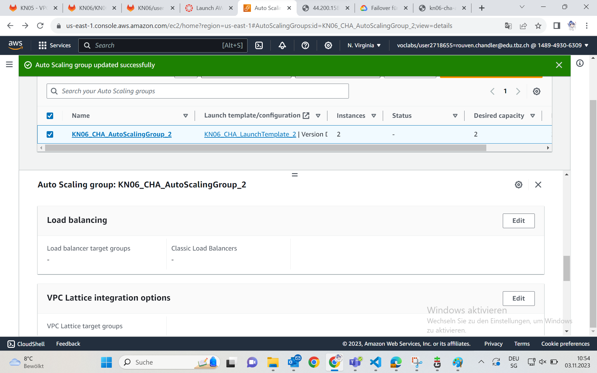

## Vorbereitung
Bevor wir hier mit dieser Aufgabe anfangen, müssen wir unsere Vermächtnisse von Aufgabe D löschen, da dies unsere neue Umgebung beeinträchtigen würde.
Gelöscht werden muss:
+ Die Auto-Scaling-Group
+ Die Instanzen
+ Den Load Balancer
+ Die Target-Groups
+ und das Launch Template.

## AWS Elasticity
Dieser Prozess kann Instanzen hoch- und herunterfahren. Damit spart man Geld und stellt trotzdem sicher, dass die Applikation einwandsfrei funktioniert.

## Launch Template
Wir erstellen als erstes ein Launch Template mit folgenden Einstellungen:
+ Name - KN06_CHA_LaunchTemplate_2
+ Description - KN06_CHA_LaunchTemplate_2
+ OS - Amazon Linux 2023 AMI (AWS)
+ Instanztyp - t2.micro
+ Kein KeyPair
+ Kein Subnetz
+ SecurityGroup - M346-CHA-Web-Access
+ UserDataCode:
~~~
#!/bin/bash
yum update -y
yum install -y httpd
systemctl start httpd
systemctl enable httpd
EC2AZ=$(TOKEN=`curl -X PUT "http://169.254.169.254/latest/api/token" -H "X-aws-ec2-metadata-token-ttl-seconds: 21600"` && curl -H "X-aws-ec2-metadata-token: $TOKEN" -v http://169.254.169.254/latest/meta-data/placement/availability-zone)
INSTID=$(TOKEN=`curl -X PUT "http://169.254.169.254/latest/api/token" -H "X-aws-ec2-metadata-token-ttl-seconds: 21600"` && curl -H "X-aws-ec2-metadata-token: $TOKEN" -v http://169.254.169.254/latest/meta-data/instance-id)
echo '
<h1 style="background-color:powderblue;">M346 KN06 D - Diese EC2 Instanz ist in der AZ: AZID </h1>
' > /var/www/html/index1.txt
echo '
<h1 style="background-color:orange;">Instanz ID: IID </h1>
' > /var/www/html/index2.txt
sed "s/AZID/$EC2AZ/" /var/www/html/index1.txt > /var/www/html/index.html
sed "s/IID/$INSTID/" /var/www/html/index2.txt >> /var/www/html/index.html
~~~

## AutoScaling Group
Im zweiten Schritt, erstellen wir die AutoScalingGroup.
Dafür suchen wir links in der Navigationsbar nach "AutoScalingGroups" und klicken drauf.
+ Name: KN06_CHA_AutoScalingGroup_2
+ LaunchTemplate: KN06_CHA_LaunchTemplate_2
+ VPC: M346-CHA-VPC
+ Beide Public Subnets
+ No load balancer
+ No VPC Lattice service

+ Desired Capacity: 2
+ Minimum Capacity: 2
+ Maximum Capacity: 4

Wenn wir jetzt eine Instanz uns zu Testzwecken anschauen würden, sehen wir dass die ID angezeigt wird uns sie funktioniert.

## Target Group
Als nächstes erstellen wir eine Target Group.
Die Konfigurierungen für diese Aufgabe sind hier:
+ Target Type: Instanzen
+ Target Group Name: KN06-CHA-TargetGroup2
+ Protocol: HTTP Port: 80
+ IP Adresstyp: IPv4
+ VPC: M346-CHA-VPC
+ Protocol Version: HTTP1
+ Health Check: HTTP
+ Health Check Path: /

+ Available Instances: Beide aktivieren die durch den AutoScaler erstellt wurden.
+ Incluide as pending below: Beide Instanzen

## Load Balancer
Die Konfigurationen die wir für den Load Balancer treffen müssen sind diese hier:
+ Load Balancer Types: Application Load Balancer
+ Name: KN06-CHA-ALB2
+ Scheme: Internet-facing
+ IP-Adressentyp: IPv4

+ VPC: M346-CHA-VPC
+ Beide Public Subnets
+ SecurityGroup: M346-CHA-Web-Access
  
+ Protocol: HTTP 80
+ KN06-CHA-TargetGroup2 auswählen

## Connecting AutoScaler & Load Balancer
Wir gehen nach unten in der AutoScalingGroup und gehen dort auf den Edit zum Load Balancer. Dort können wir ihn hinzufügen.

Natürlich per "Application, Network or Gateway, Load Balancer target groups"-Kästchen

## Dynamikkeit erzeugen
Wir gehen unter der AutoScalingGroup über diesen Pfad unten zu den "Dynamic scaling policies" und gehen auf Create

Unsere Eigenschaften sind:
+ Policy Type: Target tracking scaling
+ Scaling Policy Name: Target Tracking Policy
+ Metric Type: Application Load Balancer Request Count per targer
+ Target Group: KN06-CHA-TargetGroup2
+ Target Valuie: 20
+ Instance Warmup: 300